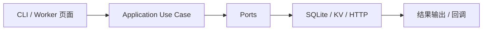

# AnyRouter / Wucur 自动签到与云端同步 — 设计（v3）

> 目标：把需求落实成明确的结构和 patch point，避免实现阶段再做关键决策。

## 1. 设计类型

### 项目类型

- 维护型项目 + 局部新结构

### 为什么属于这一类

- 仓库已有本地签到、查询、补签到和注册脚本
- 这次是在现有系统上补统一核心与云端适配

### 本次设计重点

- 维持现有 `wucur` 命令可用
- 把重复逻辑收敛到统一业务核心
- 给本地 CLI 和云端 Worker 共用一套 use case
- 把站点差异收敛到 `provider/profile`，让 `wucur` 只是首个落地 profile

## 2. 设计总览

**目标：**
形成一套可复用的签到核心，CLI、SQLite、Cloudflare KV、Worker 页面都走同一套 application 层。

**非目标：**
不在本轮重写全部现有脚本为单体应用，不做复杂多租户。

**选定方案：**
采用 `domain / application / ports / infrastructure / adapters` 分层。

**放弃方案：**
继续用多个脚本互相 subprocess 调用，不选，因为重复逻辑太多，后续维护会继续漂移。

**对应需求：**
R1-R7

### provider/profile 约定

- `provider` 表示站点适配器入口，用来选择对应的登录、签到和查询能力。
- `profile` 表示站点能力剖面，用来承接路径、字段映射、默认值和可选能力。
- `wucur` 是首个 provider/profile，未来新增网站只补 profile 和适配层，不改 use case 核心。

### ProviderProfile 字段定义

| 字段 | 类型 | 必填 | 默认值 | 约束 | 说明 |
|---|---|---|---|---|---|
| `name` | string | 是 | 无 | 唯一 | provider/profile 名称 |
| `domain` | string | 是 | 无 | 必须是可访问 URL | 站点根地址 |
| `login_path` | string | 否 | `/login` | 仅在需要页面登录时使用 | 登录页路径 |
| `login_api_path` | string \| null | 否 | `null` | 需要用户名密码登录时必填 | 登录 API 路径 |
| `sign_in_path` | string \| null | 否 | `/api/user/sign_in` | 允许为 `null` 表示自动签到或无签到接口 | 签到 API 路径 |
| `user_info_path` | string \| null | 否 | `/api/user/self` | 允许为 `null` | 用户信息 API 路径 |
| `api_user_key` | string \| null | 否 | `new-api-user` | 允许为 `null` | 请求头字段名 |
| `auth_mode` | enum | 是 | `cookie` | `cookie` / `password_session` / `bearer_login` | 认证模式 |
| `bypass_method` | enum \| null | 否 | `null` | 目前仅 `waf_cookies` | 绕过限制的方法 |
| `waf_cookie_names` | list<string> \| null | 否 | `null` | `bypass_method=waf_cookies` 时必填 | 所需 WAF cookie 名称 |

### ProviderProfileResolver 规则

- `resolve(provider_name)` 先查内置 profile，再查环境变量 `PROVIDERS` 覆盖项。
- `provider_name` 为空时，按兼容策略回退到 `anyrouter`。
- 找不到对应 profile 时返回 `UNSUPPORTED_PROVIDER`，不进入登录或签到流程。
- `resolve()` 只负责解析 profile，不负责执行网络请求或存储写入。

## 3. 现状 / 目标结构与落点

### 维护型项目现状与 patch point

| path | symbol | 当前职责 | 当前限制/问题 | 本次为什么改这里 | 对应需求 |
|---|---|---|---|---|---|
| `checkin.py` | `run_main()` | 主签到入口 | 大脚本，职责太多 | 未来要拆成 use case + adapter | R1 |
| `scripts/checkin_due_service.py` | `CheckinDueService` | 补签到编排 | 业务和外部调用耦合 | 这是核心编排入口 | R3 |
| `scripts/register_wucur.py` | `main()` | 注册+签到脚本 | 混合 I/O 和 payload 兼容 | 需要收敛成应用层调用 | R1 |
| `scripts/register_one_account_to_db.py` | `persist_success()` | 写 SQLite | 余额 payload 兼容散落 | 要统一存储适配 | R1/R6 |
| `scripts/query_wucur_accounts_db.py` | `print_table()` | 查询输出 | 仅 CLI 展示 | 未来可替换成 repository + view | R2 |
| `wucur_cli/cli.py` | `run_command()` | 命令分发 | 仍是命令映射器 | 作为薄 CLI 壳保留 | R1-R3 |

### 新项目目标结构与职责落点

| 层级 | 名称 | 职责 | 不负责什么 | 依赖方向 | 预计落地位置 | 对应需求 |
|---|---|---|---|---|---|---|
| 模块 | `domain` | 规则、状态、实体 | 不做 I/O | 被 application 依赖 | `core/domain.py` | R1-R6 |
| 模块 | `application` | use case 编排 | 不直连具体存储/网络 | 依赖 ports | `core/application/*.py` | R1-R6 |
| 模块 | `ports` | 接口定义 | 不做实现 | 被 infrastructure 实现 | `core/ports/*.py` | R1-R6 |
| 模块 | `provider/profile` | 站点能力、默认值、字段映射 | 不做 I/O | 被 application / adapters 依赖 | `core/provider_profile.py` | R7 |
| 模块 | `infrastructure` | SQLite/KV/HTTP 实现 | 不放业务规则 | 依赖 ports | `core/infrastructure/*.py` | R1-R6 |
| 组件 | `checkin-cli` | 本地命令入口 | 不写规则 | 调用 application | `cli/` | R1-R3 |
| 组件 | `worker-dashboard` | 页面、账号查看与触发 | 不执行签到 | 调用 GitHub trigger | `worker-dashboard/` | R4-R5 |

### Worker 管理后台 UI（后续）

- Worker 直接提供管理页，不拆独立前端应用。
- 样式层采用 `Tailwind CSS + daisyUI`，优先使用开源 CDN 方案，不引入本地 CSS 预编译链作为前置条件。
- 组件和交互参考 `nexus.daisyui.com` 的后台风格，优先对齐 `table`、`badge`、`card`、`modal`、`drawer` 等组件。
- 列表数据优先从 Cloudflare KV 的账号摘要读取，页面只负责展示和触发，不改写账号数据。
- 首批页面只覆盖账号列表、账号详情、最近执行结果和手动触发入口。
- 列表页负责展示账号状态、最后签到时间、最近结果和触发按钮，详情页可用 `drawer` 或 `modal` 承载。
- 页面与触发接口共用 Worker 鉴权，不单独拆出前端登录系统。

## 4. 方案选择

| 方案 | 描述 | 优点 | 风险/缺点 | 不选原因 | 结论 |
|---|---|---|---|---|---|
| A | 继续用脚本互相调用 | 改动少 | 逻辑漂移、重复、难复用 | 长期维护差 | 不选 |
| B | 分层重构 + ports + adapters | 复用强、可测试、可扩展 | 初期改动较大 | — | 选用 |

## 5. 端到端流程

### 流程步骤

1. CLI 或 Worker 接收输入。
2. 入口只做参数解析和认证。
3. Application 调用 repository / checkin client / clock。
4. Infrastructure 负责 SQLite、KV 和 HTTP。
5. 输出由入口层负责，不把业务规则散到入口里。

## 6. 数据结构与状态模型

### 数据结构

| 名称 | 字段 | 类型 | 必填 | 默认值 | 约束 | 来源/去向 |
|---|---|---|---|---|---|---|
| `AccountRecord` | `provider` | string | 是 | 无 | 与 `username` 共同定位账号 | CLI / Worker -> repo |
|  | `username` | string | 是 | 无 | 唯一 | CLI / Worker -> repo |
|  | `registration_info` | object | 是 | 无 | 见下方 `RegistrationInfo` | use case -> repo |
|  | `password_encrypted` | string | 是 | 无 | 不明文输出 | repo -> storage |
|  | `balance_after` | float | 否 | 无 | 可为空 | checkin client -> repo |
|  | `checkin_date` | date string | 否 | 无 | `YYYY-MM-DD` | use case -> repo |
|  | `last_checkin_at` | datetime string | 否 | 无 | 可为空 | use case -> repo |

### RegistrationInfo 字段定义

| 字段 | 类型 | 必填 | 默认值 | 约束 | 说明 |
|---|---|---|---|---|---|
| `registered_at` | datetime string | 是 | 无 | `YYYY-MM-DD HH:MM:SS` | 注册发生时间 |
| `registered_via` | string | 是 | 无 | `CLI` / `Worker` / `Actions` | 注册触发来源 |
| `registration_status` | string | 是 | 无 | `success` / `failed` | 注册结果状态 |

### 状态变更与副作用

| 触发条件 | 写入对象/外部系统 | 原子性要求 | 幂等性 | 重试策略 | 失败补偿 | 回滚方式 |
|---|---|---|---|---|---|---|
| 注册成功并签到成功 | SQLite / KV | 单条记录尽量原子 | 同账号重复执行应覆盖或去重 | 网络失败可重试 | 不写成功状态 | 失败不提交成功记录 |

## 7. 外部契约映射

| 契约 ID | 入口 | 输入结构 | 输出结构 | 错误码/错误消息 | 对应处理符号 |
|---|---|---|---|---|---|
| C1 | `register` CLI | username/password | 注册+签到结果 | `LOGIN_FAILED` / `CHECKIN_FAILED` | `RegisterAndCheckinAccountUseCase` |
| C2 | `query` CLI | limit/db path | 表格输出 | `DB_NOT_FOUND` | `ListAccountsUseCase` |
| C3 | `check-due` CLI | provider/date/backend | summary | `INVALID_TIMEZONE` / `BACKEND_WRITE_FAILED` | `CheckDueAccountsUseCase` |
| C4 | Cloudflare KV 写入 | provider_scope/records/account_key | kv write result | `BACKEND_WRITE_FAILED` | `CloudflareKvAccountRepository` |
| C5 | Worker 页面按钮 | workflow/token | dispatch result | `AUTH_FAILED` / `DISPATCH_FAILED` | `SyncRemoteTriggerUseCase` |

### Worker 触发约定

- `workflow` 为空时默认 `checkin`，成功响应应回传 `defaulted` 标记。
- `token` 可通过 `token` 查询参数或 `x-worker-token` 请求头传入。
- `GITHUB_TOKEN` 缺失或 GitHub 触发失败时返回 `DISPATCH_FAILED`，不在 Worker 内执行签到。

## 8. 职责边界与实现边界

### 模块 / 组件边界

| 层级 | 名称 | 职责 | 禁止承载的职责 | 与谁交互 | 边界说明 |
|---|---|---|---|---|---|
| module | `application` | 编排用例 | 不写 SQLite/KV 代码 | ports | 只依赖接口 |
| module | `ports` | 接口定义 | 不写实现 | application / infrastructure | 稳定契约层 |
| module | `provider/profile` | 站点差异归一和默认值解析 | 不直接执行 HTTP/DB | application / infrastructure | `wucur` 只是首个 profile，后续网站只新增 profile/adapter |
| component | `worker` | 页面和触发 | 不做签到逻辑 | GitHub API | 薄入口 |

### 关键文件 / 类 / 方法边界

| 类型 | 名称 | 负责什么 | 不负责什么 | 为什么必须提前定义 |
|---|---|---|---|---|
| 类 | `CheckinDueService` | 补签到编排 | 不负责 UI | 是用例核心 |
| 接口 | `AccountRepository` | 存储抽象 | 不负责查询输出排版 | 控制 SQLite/KV 漂移 |
| 接口 | `CheckinClient` | 外部签到 HTTP | 不负责命令解析 | 统一本地/云端复用 |
| 接口 | `ProviderProfileResolver` | 解析站点 profile 和默认值 | 不负责业务编排 | 防止 `wucur` 写死在 use case |

## 9. 文件变更计划 / 目标文件骨架

### 维护型项目文件变更计划

| 文件 | 操作 | 目标符号/类/函数 | 禁止变更的符号 | 变更内容 | 对应需求 |
|---|---|---|---|---|---|
| `checkin.py` | 修改/拆分 | `run_main()` | 现有 CLI 参数名 | 拆成入口 + use case | R1 |
| `scripts/checkin_due_service.py` | 修改 | `CheckinDueService.run()` | `CheckinAccountResult` | 接 ports、去直连细节 | R3 |
| `scripts/register_one_account_to_db.py` | 修改 | `extract_balance()` | 旧命令参数 | 兼容统一 payload | R1/R6 |
| `scripts/register_wucur.py` | 修改 | `main()` | 旧输出字段名 | 统一调用底层用例 | R1 |

### 新项目目标文件骨架

| 文件/目录 | 类型 | 职责 | 为什么存在 | 对应模块/组件 | 对应需求 |
|---|---|---|---|---|---|
| `core/domain/` | 目录 | 领域对象 | 统一数据模型 | domain | R1-R6 |
| `core/application/` | 目录 | 用例编排 | 复用业务流程 | application | R1-R6 |
| `core/ports/` | 目录 | 接口定义 | 解耦实现 | ports | R1-R6 |
| `core/infrastructure/` | 目录 | 适配层 | SQLite/KV/HTTP | infrastructure | R1-R6 |
| `cli/` | 目录 | CLI 入口 | 本地操作 | adapter | R1-R3 |
| `worker-dashboard/` | 目录 | Cloudflare Worker 管理后台目录 | 云端触发 | adapter | R4-R5 |

## 10. 错误处理

| 场景 | 检测点 | 系统处理 | 用户可见结果 | 是否可重试 | 日志要求 | 指标/告警 |
|---|---|---|---|---|---|---|
| 登录失败 | checkin client | 返回失败结果，不写成功状态 | 明确错误码 | 是 | 只记摘要 | 计数 |
| 非法输入 | CLI / Worker 参数解析 | 返回校验失败，不进入用例 | `INVALID_LIMIT` / `INVALID_PROVIDER_SCOPE` / `INVALID_PAYLOAD` | 否 | 只记输入摘要 | 计数 |
| 配置错误 | `ProviderProfileResolver` / env 读取 | 返回配置错误，不执行外部调用 | `CONFIG_MISSING` / `CONFIG_INVALID` | 否，修正配置后再试 | 记录缺失配置键名 | 告警 |
| 不支持的 provider/profile | `ProviderProfileResolver` | 返回 `UNSUPPORTED_PROVIDER`，不进入登录或签到流程 | `UNSUPPORTED_PROVIDER` | 否 | 记录 provider 名称 | 计数 |
| KV 写失败 | repository | 失败返回，不标记成功 | 明确失败码 | 是 | 记录 backend 名称 | 告警 |
| Worker 鉴权失败 | worker handler | 返回 `AUTH_FAILED` | 页面展示失败 | 否 | 记录 token 校验失败摘要 | 计数 |
| Worker 触发失败 | trigger port | 返回 `DISPATCH_FAILED` | 页面展示失败 | 是 | 记录 workflow 名称 | 计数 |
| 不可恢复内部错误 | application / use case | 返回通用错误码并中断当前账号 | `INTERNAL_ERROR` | 否，需人工检查 | 记录堆栈摘要和上下文 | 告警 |

## 11. 兼容性、迁移与回滚

### 兼容性

- 旧的 `wucur` CLI 保持可用。
- 现有 SQLite 查询命令保持可用。
- 现有 `checkin-due` 命令保持可用。

### 迁移步骤

1. 先把 domain / ports 抽出来。
2. 再把现有脚本接到新 use case。
3. 最后接 Cloudflare KV 和 Worker 页面。

### 回滚方式

1. 若重构失败，保留旧 CLI 作为回退入口。
2. 新增的云端适配可独立关闭。

## 12. 依赖与配置变更

### 依赖策略

| 依赖 | 动作 | 版本范围 | 原因 | 替代方案 | 风险 |
|---|---|---|---|---|---|
| `httpx` | 不变 | 当前版本 | 现有网络调用 | 无 | 低 |
| `tzdata` | 可选 | 仅云端/Windows 兜底 | 解决时区 | 固定 UTC+8 回退 | 低 |

### 云端密码加密约定

- 云端持久化前必须先将密码转换为密文，再写入 KV。
- 加密密钥必须来自环境变量或云端 secret，缺失时仓库直接返回配置错误。
- 明文密码只允许在本地运行时短暂存在于内存中，不得写入云端存储、日志或调试输出。

### 配置项

| 配置名 | 位置 | 默认值 | 是否必填 | 错误配置时的行为 | 对应需求 |
|---|---|---|---|---|---|
| `ANYROUTER_ACCOUNTS` | env | 无 | 是 | CLI/Actions 读取失败 | R1-R3 |
| `GITHUB_TOKEN` | env/secret | 无 | 云端必填 | Worker 触发失败 | R5 |
| `CLOUDFLARE_KV` | env/secret | 无 | 云端必填 | 云端存储失败 | R4 |
| `PASSWORD_ENCRYPTION_KEY` | env/secret | 无 | 云端必填 | 云端密码加密失败 | R4 / R6 |

## 13. 安全与数据处理

| 类别 | 约束 | 实现要求 | 验证方式 |
|---|---|---|---|
| 敏感数据 | 密码不可明文打印 | 统一脱敏 | 搜索日志输出 |
| 鉴权 | Worker 页面和回调都要鉴权 | Secret / token 校验 | 请求拒绝测试 |
| 输入校验 | 命令参数和 JSON 配置 | 入口层校验 | 单测 |
| 密码保护 | 云端写入前加密密码 | 密钥缺失即失败 | repository 单测 |

## 14. 测试与验证策略

| 测试类型 | 覆盖点 | 工作目录 | 命令 | 通过标准 | 回归保护对象 |
|---|---|---|---|---|---|
| 单元测试 | domain / use case | `anyrouter-check-in` | `uv run pytest` | 全绿 | 现有 CLI 行为 |
| 集成测试 | SQLite / 查询 / 补签到 | `anyrouter-check-in` | `uv run pytest tests/...` | 全绿 | 数据写入 |
| 结构检查 | 文档/接口边界 | `anyrouter-check-in` | 手动评审 | 设计一致 | 模块职责 |

## 15. 需求追踪

| Requirement | 设计章节 | 文件/符号 | 测试/验证 |
|---|---|---|---|
| R1 | 3 / 8 / 9 | `RegisterAndCheckinAccountUseCase` | 注册测试 |
| R2 | 3 / 8 / 9 | `ListAccountsUseCase` | 查询测试 |
| R3 | 3 / 8 / 9 | `CheckDueAccountsUseCase` | 补签到测试 |
| R4 | 3 / 11 | `CloudflareKvAccountRepository` | KV 仓库测试 |
| R5 | 3 / 8 / 11 | `Worker` trigger handler | 触发测试 |
| R6 | 6 / 7 / 12 | `AccountRecord` / `persist_success` / repo write path | 记录字段测试 |
| R7 | 2 / 3 / 8 | `ProviderProfile`, `ProviderProfileResolver` | provider/profile 抽象测试 |
| R8 | 3 / 7 / 8 / 9 / 13 | `worker` admin UI | 后台 UI 测试 |

## 16. 实现前最终检查

- [ ] requirements 中无未关闭阻断项
- [ ] 已明确当前是维护型项目还是新项目
- [ ] 已明确选定方案，未把关键决策留给实现模型
- [ ] 维护型项目已明确 patch point 到文件和符号级
- [ ] 新项目已明确目标结构到模块/组件/关键文件级
- [ ] 已明确关键方法或等价处理单元必须提前定义职责边界
- [ ] 已明确副作用、幂等性、重试、补偿、回滚
- [ ] 已明确旧行为兼容性和回归验证
- [ ] 已明确是否允许新增依赖
- [ ] 已明确 `provider/profile` 只是抽象边界，不是本轮接入第二个网站
- [ ] 已明确 Worker 管理后台 UI 的数据来源和展示边界
