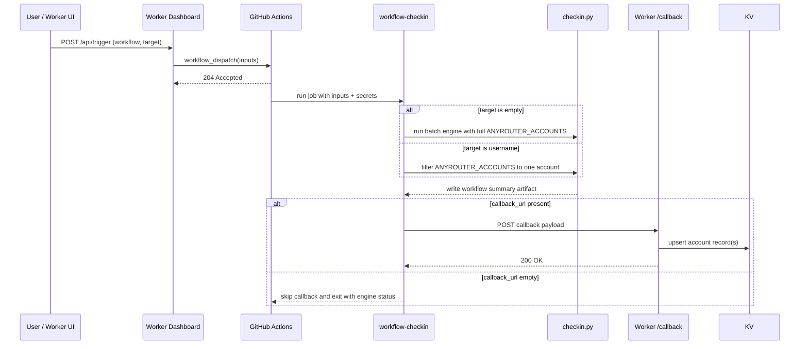

# AnyRouter / Wucur GitHub Actions 协作闭环 — 设计（v4.1，双模型流水线版）

> 目标：把已合格需求转成可直接交给实现模型的设计约束，同时禁止设计阶段自己发散出新需求。  
> 前提：requirements-v4.1 已无未关闭阻断项，且设计里的外显行为都能追溯到 R10 / R11。

## 使用规则

- 必须明确选择一个方案，不能把关键决策留给实现模型。
- 必须给每个设计项标记来源类型：`REQ`、`IMPL`、`TEST`、`OUT`。
- `REQ` 只能来自需求 ID，且必须能追踪到具体需求。
- `IMPL` 只能描述实现细节，不能新增或改变外显行为。
- `TEST` 只能描述验证和回归，不得引入新产品行为。
- `OUT` 只能放发散候选或本次不纳入项，不得进入 tasks。
- 任何新增外显行为，只要需求里找不到对应 ID，就视为发散需求，必须退回需求阶段。

## 1. 设计类型

### 项目类型

- 维护型项目 + 局部新结构

### 为什么属于这一类

- 仓库里已经有 Worker 触发、GitHub dispatch、`checkin.py` 批量执行引擎和 `/callback` 落库入口。
- 本次不是重写签到核心，而是补一个 GitHub workflow bridge，让调度和回调形成闭环。
- 旧的 `schedule` / 手动 `workflow_dispatch` / 本地 `checkin.py` 兼容路径都必须继续可用。

### 本次设计重点

- 保持 `worker-dashboard` 仍然只是薄后台，不把签到逻辑搬进 Worker。
- 保持 `python/src/cli/checkin.py` 仍然是批量签到引擎，不把 GitHub API 和 Worker KV 混进去。
- 新增 `python/src/tools/workflow/` 作为 GitHub Actions 专用桥接层，负责参数过滤、结果汇总和回调。
- 修正 `worker-dashboard/src/pages/callback.js` 的“默认成功”写法，避免失败结果被伪装成成功。

## 2. 设计总览

**目标：**  
让 Worker 发起的 workflow dispatch 能携带 `workflow / action / target / callback_url`，GitHub runner 执行后再把结果回调到 Worker 并写回 KV。

**非目标：**  
不在 Worker 内直接执行注册或签到；不引入队列 / 轮询 / 长连接；不改变 v4 的 R1-R9 业务语义；不新增除 GitHub Actions 之外的执行通道。

**选定方案：**  
采用“Worker 只负责编排 dispatch，GitHub Actions 通过薄桥接脚本执行既有 `checkin.py` 并回调 Worker”的方案。

**放弃方案：**  
放弃“让 Worker 等待 workflow 完成再同步返回”与“直接解析日志推断结果”的方案，因为它们要么不现实，要么太脆弱。

**对应需求：**  
R10, R11

### 2.1 设计来源与边界

| 设计项ID | 来源类型 | 来源需求ID | 是否改变外显行为 | 是否允许进入 tasks | 说明 |
|---|---|---|---|---|---|
| D13 | REQ | R10 | 是 | 是 | workflow dispatch 输入与路由契约 |
| D14 | REQ | R11 | 是 | 是 | callback payload 与 KV 写回契约 |
| D15 | IMPL | R10, R11 | 否 | 是 | workflow bridge、summary artifact、target 过滤 |
| D16 | TEST | R10, R11 | 否 | 是 | dispatch / callback / 回归验证 |
| D17 | OUT | 无 | 否 | 否 | 队列化、轮询 workflow 状态、实时进度流 |

规则：
- 任何 `REQ` 项必须能追到需求 ID。
- 任何改变外显行为的设计项，必须是 `REQ`，不能伪装成 `IMPL`。
- `OUT` 项不得进入 tasks，也不得出现在实现结论里。

## 3. 现状 / 目标结构与落点

### 维护型项目现状与 patch point

| path | symbol | 当前职责 | 当前限制/问题 | 本次为什么改这里 | 对应需求 |
|---|---|---|---|---|---|
| `worker-dashboard/src/lib/github.js` | `triggerWorkflow()` | 调 GitHub dispatch | 现在把 workflow 处理得过于固定，且不接 workflow inputs | 这里是 dispatch 请求的唯一出口，必须显式带上 inputs | R10 |
| `worker-dashboard/src/pages/actions.js` | `apiTrigger()` | 鉴权后触发 workflow | 当前只是在 Worker 侧拼 body，未明确规范 workflow / callback_url / target | 这里负责把请求归一成可 dispatch 的输入 | R10 |
| `worker-dashboard/src/pages/callback.js` | `handleCallback()` | 回调写 KV | 现在 `checkin` 分支默认写成功，失败结果会被伪装 | 必须让失败 payload 也能安全落库 | R11 |
| `.github/workflows/checkin.yml` | `checkin` job | 固定签到工作流 | 目前没有 inputs，也没桥接 callback | 这里是 GitHub Actions 的唯一运行入口 | R10, R11 |
| `python/src/cli/checkin.py` | `main()` / `run_main()` | 批量签到引擎 | 只打印人类日志，缺少机器可读摘要 | workflow bridge 需要稳定摘要，不该解析 stdout | R11 |
| `python/src/tools/workflow/` | `main()`（新） | workflow bridge | 当前不存在 | 这里承接 GitHub Actions 专用 orchestration | R10, R11 |
| `pyproject.toml` | `[project.scripts]` | console script 配置 | 目前没有 workflow runner 入口 | GitHub Actions 需要一个稳定可调用的入口名 | R10, R11 |

### 目标结构与职责落点

| 层级 | 名称 | 职责 | 不负责什么 | 依赖方向 | 预计落地位置 | 对应需求 |
|---|---|---|---|---|---|---|
| 组件 | `worker-dashboard` | 触发 workflow、接收 callback、写回 KV | 不执行签到本身 | 依赖 GitHub API / KV | `worker-dashboard/` | R10, R11 |
| 组件 | `workflow-checkin` | GitHub Actions 专用桥接 | 不直接持久化 Worker KV | 依赖 `checkin.py` / `callback_url` | `python/src/tools/workflow/` | R10, R11 |
| 组件 | `checkin.py` | 既有批量签到引擎 | 不知道 GitHub dispatch / callback 协议 | 只依赖本地 env / 远端站点 | repo 根目录 + `python/src/cli/checkin.py` | R11 |
| 组件 | `callback endpoint` | KV 写回入口 | 不执行签到 | 依赖 `putAccount()` | `worker-dashboard/src/pages/callback.js` | R11 |

## 4. 方案选择

| 方案 | 描述 | 优点 | 风险/缺点 | 不选原因 | 结论 |
|---|---|---|---|---|---|
| A | 直接让 workflow 调 `checkin.py`，再从 stdout 里猜结果并回调 | 改动看似最少 | 日志不稳定、失败语义难以严谨表达 | 结果解析太脆，无法保证不 fake success | 不选 |
| B | 新增 `workflow-checkin` 桥接脚本，`checkin.py` 产出机器可读摘要，再由桥接脚本回调 Worker | 结果稳定、兼容现有批量引擎、可控地处理单目标 / 批量 | 多一个薄层 | — | 选用 |

## 5. 端到端流程

### 流程步骤

1. Worker 后台收到触发请求，先做 session/token 鉴权。
2. `apiTrigger()` 归一化 `workflow / action / target / callback_url`，其中 `callback_url` 默认由当前请求 origin 生成。
3. `triggerWorkflow()` 向 GitHub dispatch API 发送 `workflow_dispatch` 和 inputs。
4. GitHub Actions job 启动后，把 inputs 映射成环境变量，再调用 `workflow-checkin`。
5. `workflow-checkin` 先按 `target` 精确过滤 `ANYROUTER_ACCOUNTS`；`target` 为空则走全量批量流程。
6. `workflow-checkin` 通过子进程调用 `checkin.py`，并要求 `checkin.py` 在 `python/artifacts/workflow/` 下写出机器可读摘要。
7. `workflow-checkin` 读取摘要后构造 callback payload，若 `callback_url` 非空则 POST 到 Worker `/callback`。
8. `handleCallback()` 校验 `CALLBACK_SECRET` 后按 `checkin` / `batch_result` 语义写回 KV。
9. `workflow-checkin` 只负责回调和退出码转换，不负责把失败伪装成成功。

### 5.1 workflow-checkin 运行契约

| 参数 / 环境 | 类型 | 必填 | 默认值 | 说明 |
|---|---|---|---|---|
| `--workflow` | string | 是 | `checkin.yml` | GitHub workflow 文件名，仅用于桥接层和摘要写入 |
| `--action` | string | 是 | `checkin` | v4.1 固定动作名 |
| `--target` | string | 否 | 空字符串 | 目标账号用户名；空表示批量流程 |
| `--callback-url` | string | 否 | 空字符串 | workflow 完成后回调地址；schedule/manual 可空 |
| `--summary-path` | string | 否 | `python/artifacts/workflow/checkin-result.json` | `checkin.py` 写出的机器可读摘要路径 |
| `ANYROUTER_ACCOUNTS` | env | 是 | 无 | GitHub Actions secret，桥接层过滤 target 与调用引擎都依赖它 |
| `WORKFLOW_SUMMARY_PATH` | env | 由桥接层设置 | 见上 | `checkin.py` 读取此环境变量后把 `WorkflowCheckinSummary` 写成 JSON |

运行约定：

- `workflow-checkin` 不解析 `checkin.py` 的 stdout。
- `workflow-checkin` 只读取 `WORKFLOW_SUMMARY_PATH` 指向的 JSON 文件。
- `workflow-checkin` 调用 `checkin.py` 时必须把 `WORKFLOW_SUMMARY_PATH` 透传到子进程环境中。
- `target` 非空时必须按 `account.username` 精确匹配；匹配不到则桥接层退出非 0，且不回调。

## 6. 数据结构与状态模型

### 数据结构

| 名称 | 字段 | 类型 | 必填 | 默认值 | 约束 | 来源/去向 |
|---|---|---|---|---|---|---|
| `WorkflowDispatchInput` | `workflow` | string | 是 | `checkin.yml` | 仅允许仓库内可 dispatch 的 workflow，v4.1 仅 `checkin.yml` | Worker -> GitHub Actions |
|  | `action` | string | 是 | `checkin` | v4.1 固定 `checkin` | Worker -> GitHub Actions |
|  | `target` | string \| null | 否 | `''` | 空串表示批量流程；非空表示精确用户名目标 | Worker -> GitHub Actions |
|  | `callback_url` | string \| null | 否 | `''` | 绝对 HTTPS URL；schedule/manual 可空 | Worker -> GitHub Actions |
| `WorkflowAccountResult` | `username` | string | 是 | 无 | 账号名 | `checkin.py` -> bridge -> callback |
|  | `success` | bool | 是 | 无 | `true` / `false` | `checkin.py` -> bridge -> callback |
|  | `status` | string | 否 | `active` / `failed` | 兼容旧 payload，失败时不得写 active 假值 | `checkin.py` -> callback |
|  | `balance` | string \| number | 否 | 无 | 可为空 | `checkin.py` -> callback |
|  | `checkin_time` | string \| null | 否 | 当前时间 | `ISO 8601` 优先；缺失时可由 Worker 补齐 | `checkin.py` -> callback |
|  | `last_result` | string | 是 | 无 | 成功/失败描述 | `checkin.py` -> callback |
|  | `message` | string \| null | 否 | 无 | 附加说明 | `checkin.py` -> callback |
| `WorkflowBatchResult` | `results` | list<WorkflowAccountResult> | 是 | `[]` | `results` 必须是数组；无 `username` 的条目跳过 | `workflow-checkin` -> callback |
| `WorkflowCheckinSummary` | `workflow` | string | 是 | 无 | `checkin.yml` | `checkin.py` 写入 artifacts |
|  | `action` | string | 是 | `checkin` | `checkin` | `checkin.py` 写入 artifacts |
|  | `target` | string \| null | 否 | `''` | 同 `WorkflowDispatchInput.target` | `checkin.py` 写入 artifacts |
|  | `exit_code` | int | 是 | 无 | `0` / `1` | `checkin.py` 写入 artifacts |
|  | `success_count` | int | 是 | 0 | 非负整数 | `checkin.py` 写入 artifacts |
|  | `failed_count` | int | 是 | 0 | 非负整数 | `checkin.py` 写入 artifacts |
|  | `results` | list<WorkflowAccountResult> | 是 | `[]` | 不含密码 / token / cookies | `checkin.py` 写入 artifacts |

### summary artifact format

- 文件路径固定为 `python/artifacts/workflow/checkin-result.json`
- 文件编码为 UTF-8 JSON
- 文件内容必须与 `WorkflowCheckinSummary` 一致
- `checkin.py` 负责写入，`workflow-checkin` 负责读取
- 一个 workflow run 只维护一份最新摘要，重复执行覆盖写

### 状态变更与副作用

| 触发条件 | 写入对象/外部系统 | 原子性要求 | 幂等性 | 重试策略 | 失败补偿 | 回滚方式 |
|---|---|---|---|---|---|---|
| Worker 成功 dispatch | GitHub Actions | 只需一次 dispatch 请求成功 | 非幂等，避免自动重试造成重复 run | 不自动重试 | 不写 KV | 无，属于 ack 阶段 |
| workflow 完成后 callback 成功 | Worker KV | 单账号 upsert 原子 | 以 `username` upsert，重复回调可覆盖 | callback 可重试 | 失败结果也按状态写回 | 再次 callback 覆盖 |
| workflow 生成 summary artifact | `python/artifacts/workflow/checkin-result.json` | 文件写入尽量原子 | 同一次 run 只写一份 | 覆盖写 | 无 | 删除 artifact |

## 7. 外部契约映射

| 契约样例ID | 来源需求ID | 入口 | 输入结构 | 输出结构 | 错误码/错误消息 | 对应处理符号 |
|---|---|---|---|---|---|---|
| C4 | R10 | Worker `/api/trigger` -> GitHub dispatch | `workflow`, `action`, `target`, `callback_url`, `token` | `success`, `workflow`, `defaulted`, `dispatch_id` | `AUTH_FAILED`, `INVALID_CALLBACK_URL`, `DISPATCH_FAILED` | `apiTrigger()`, `triggerWorkflow()` |
| C5 | R11 | Worker `/callback` | `secret`, `action`, `data` | `ok` / 2xx / 4xx | `UNAUTHORIZED`, `INVALID_PAYLOAD` | `handleCallback()` |

### Worker 触发约定

- `workflow` 默认归一为 `checkin.yml`，并允许 `checkin` 作为别名。
- `action` 在 v4.1 固定为 `checkin`。
- `target` 为空时走批量流程，非空时桥接脚本按用户名精确过滤账号列表。
- `callback_url` 由 Worker 默认生成当前请求 origin 的 `/callback`，若显式提供则必须是绝对 HTTPS URL。
- `dispatch_id` 是 Worker 侧的回执标识，不是 GitHub run id。

### 回调约定

- `checkin` 回调使用单条 `WorkflowAccountResult`，适合单目标场景。
- `batch_result` 回调使用 `WorkflowBatchResult.results[]`，适合批量场景；每个条目独立 upsert，部分无效条目跳过。
- `success=false` 或 `status=failed` 的回调 payload 仍然是合法业务结果，Worker 必须写成失败态，不能伪装成成功。
- 仅当 secret / body 不合法时，才返回 400/401 且不写 KV。

### batch_result payload

| 字段 | 类型 | 必填 | 默认值 | 约束 | 说明 |
|---|---|---|---|---|---|
| `secret` | string | 是 | 无 | 必须与 Worker `CALLBACK_SECRET` 一致 | 回调鉴权 |
| `action` | string | 是 | `batch_result` | 只能是 `batch_result` | 批量回调标识 |
| `data.results` | list<WorkflowAccountResult> | 是 | `[]` | 必须是数组 | 每条结果对应一个账号 |
| `data.workflow` | string | 否 | `checkin.yml` | 可空 | 便于审计和追踪 |
| `data.target` | string \| null | 否 | `''` | 可空 | 目标用户名；批量流程通常为空 |

规则：

- `data.results` 中每个条目都必须包含 `username`。
- 任何缺少 `username` 的条目都跳过，不影响其他条目写回。
- `success=false` 的条目必须写成 failed 态，不能被覆盖成 active。
- 如果 `data.results` 为空数组，Worker 仍应返回 200，但不写任何记录。

## 8. 职责边界与实现边界

### 模块 / 组件边界

| 层级 | 名称 | 职责 | 禁止承载的职责 | 与谁交互 | 边界说明 |
|---|---|---|---|---|---|
| component | `worker-dashboard` | 触发 GitHub workflow、接收回调、写回 KV | 不执行签到本身 | GitHub API / KV | 薄入口，保持后台职责 |
| component | `workflow-checkin` | GitHub Actions 专用桥接 | 不直接写 Worker KV | `checkin.py` / Worker `/callback` | 只做 orchestration |
| component | `checkin.py` | 批量签到执行 | 不做 GitHub dispatch / callback | 远端站点 / 本地 env | 保持既有引擎职责 |
| component | `callback endpoint` | KV 写回入口 | 不执行签到 / 不发起 dispatch | `putAccount()` | 只做结果落库 |

### 关键文件 / 类 / 方法边界

| 类型 | 名称 | 负责什么 | 不负责什么 | 为什么必须提前定义 |
|---|---|---|---|---|
| 方法 | `worker-dashboard/src/lib/github.js::triggerWorkflow()` | 构造 GitHub dispatch 请求体并发起调用 | 不解释账号结果 | 这里决定 inputs 是否真的被消费 |
| 方法 | `worker-dashboard/src/pages/actions.js::apiTrigger()` | 鉴权、归一化 workflow / target / callback_url | 不写 KV | 这里是 Worker 对外触发入口 |
| 方法 | `python/src/tools/workflow/run_checkin_workflow.py::main(argv)` | 接收 `--workflow` / `--action` / `--target` / `--callback-url` / `--summary-path`，过滤 target，调用 `checkin.py`，回调 Worker | 不改业务规则 | 这里是 GitHub Actions 专用 bridge |
| 方法 | `python/src/cli/checkin.py::main()` / `write_workflow_summary()` | 生成 `WorkflowCheckinSummary` 并按 `WORKFLOW_SUMMARY_PATH` 写文件 | 不发送 callback | 需要把人类日志和机器摘要分开 |
| 方法 | `worker-dashboard/src/pages/callback.js::handleCallback()` | 校验 secret，按 success/status 写回 KV | 不推断成功状态 | 避免失败 payload 被写成 active |

## 9. 文件变更计划 / 目标文件骨架

### 维护型项目文件变更计划

| 文件 | 操作 | 目标符号/类/函数 | 禁止变更的符号 | 变更内容 | 对应需求 |
|---|---|---|---|---|---|
| `.github/workflows/checkin.yml` | 修改 | `workflow_dispatch` / job `checkin` | `schedule` 触发 | 定义 inputs，并切换到 `workflow-checkin` 桥接脚本 | R10, R11 |
| `worker-dashboard/src/lib/github.js` | 修改 | `triggerWorkflow()` | `fetch()` 路由本身 | 接收显式 `workflow` 输入，构造 dispatch payload | R10 |
| `worker-dashboard/src/pages/actions.js` | 修改 | `apiTrigger()` | `authMiddleware()` | 归一化 workflow，生成同源 callback_url，传递 target | R10 |
| `worker-dashboard/src/pages/callback.js` | 修改 | `handleCallback()` | `putAccount()` | 支持 `success/status/last_result`，失败结果不再伪装成成功 | R11 |
| `python/src/cli/checkin.py` | 修改 | `main()` / `run_main()` / `write_workflow_summary()` | 现有对外运行方式 | 在 workflow 模式下写出机器可读 summary artifact | R11 |
| `python/src/tools/workflow/run_checkin_workflow.py` | 新增 | `main()` | 无 | workflow 专用 bridge：过滤 target、调用引擎、发 callback | R10, R11 |
| `python/src/tools/workflow/__init__.py` | 新增 | 包标记 | 无 | 作为可导入 package | R10, R11 |
| `pyproject.toml` | 修改 | `[project.scripts]` | 现有 `wucur` / `site_cli` | 增加 `workflow-checkin` console script | R10, R11 |

### 目标文件骨架

| 文件/目录 | 类型 | 职责 | 为什么存在 | 对应模块/组件 | 对应需求 |
|---|---|---|---|---|---|
| `python/src/tools/workflow/` | 目录 | GitHub Actions 专用 orchestration | 把 workflow 和业务引擎分开 | `workflow-checkin` | R10, R11 |
| `python/artifacts/workflow/` | 目录 | workflow 运行时摘要文件 | 给 bridge 读取，不解析 stdout | `checkin.py` | R11 |

## 10. 错误处理

| 场景 | 检测点 | 系统处理 | 用户可见结果 | 是否可重试 | 日志要求 | 指标/告警 |
|---|---|---|---|---|---|---|
| Worker 鉴权失败 | `apiTrigger()` | 直接返回 401 | `AUTH_FAILED` | 否 | 记录 rid，不记录 token | 计数 |
| callback_url 缺失 / 非 HTTPS | `apiTrigger()` | 直接返回失败，不 dispatch | `INVALID_CALLBACK_URL` | 否 | 记录 normalized 结果 | 计数 |
| workflow 名称不合法 | `triggerWorkflow()` | 归一失败则返回 dispatch 失败 | `DISPATCH_FAILED` | 否 | 记录被拒绝的 workflow | 计数 |
| GitHub dispatch 403 / 5xx / 网络错误 | `triggerWorkflow()` | 返回 502 `DISPATCH_FAILED` | Worker 不会进入 workflow | 否 | 记录 status / body 截断 | 告警 |
| `target` 过滤后无匹配账号 | `workflow-checkin` | workflow 直接失败，且不回调 | GitHub job 失败 | 否 | 记录 target 过滤失败原因 | 计数 |
| `checkin.py` 未写出 summary artifact | `workflow-checkin` | workflow 失败，且不回调 | GitHub job 失败 | 否 | 记录 artifact path | 告警 |
| callback secret 错误 / body 非法 | `handleCallback()` | 返回 401/400，且不写 KV | 失败 | 是（修正后重试） | 记录拒绝原因，不打印 secret | 计数 |
| batch_result payload 类型错误 | `handleCallback()` | 返回 400，且不写 KV | `INVALID_PAYLOAD` | 否 | 记录 payload 类型错误 | 计数 |
| callback transport 失败 / 超时 | `workflow-checkin` | 重试少量次数后失败退出 | GitHub job 失败，但 KV 不伪造成功 | 是 | 记录重试次数和最终失败 | 告警 |
| callback payload 显式失败态 | `handleCallback()` | 仍返回 200，但写入 failed 状态 | 失败结果被如实落库 | 否 | 记录 success=false / status=failed | 计数 |

## 11. 兼容性、迁移与回滚

### 兼容性

- `schedule` 和手动 `workflow_dispatch` 仍走同一份 `checkin.yml`，只是 `callback_url` 为空时跳过回调。
- `checkin.py` 仍可像以前一样直接运行，workflow 摘要能力是可选增强，不破坏本地使用。
- Worker `/callback` 仍兼容旧的 `register` / `checkin` / `batch_result` 语义，只是新增了 `success/status/last_result` 的失败表达能力；`batch_result` 继续按每条结果独立写回。

### 迁移步骤

1. 在 `checkin.yml` 里先引入 inputs 和 `workflow-checkin`，但保留 `checkin.py` 作为最终执行引擎。
2. 先上线 Worker dispatch 和 callback 兼容写回，再切换 target 模式。
3. 验证 schedule/manual 没有回归后，再把旧的直接脚本调用路径逐步收敛到 bridge。

### 回滚方式

1. 如果 workflow bridge 有问题，先把 `checkin.yml` 的执行步骤切回 `uv run checkin.py`。
2. 若 callback 处理有问题，只关闭 `callback_url` 传递即可，dispatch 与批量执行仍保留。
3. `checkin.py` 的摘要写入是幂等附加能力，回滚时可以先不读取，不必先删。

## 12. 依赖与配置变更

### 依赖策略

| 依赖 | 动作 | 版本范围 | 原因 | 替代方案 | 风险 |
|---|---|---|---|---|---|
| `httpx` | 不变 | 现有版本 | workflow bridge 发 callback 可直接复用 | 退回 `urllib` | 无新增依赖 |
| `pyproject.toml` console script | 新增 | 无 | 提供稳定 `workflow-checkin` 入口 | 直接 `python -m` | 入口名变化风险低 |

### 配置项

| 配置名 | 位置 | 默认值 | 是否必填 | 错误配置时的行为 | 对应需求 |
|---|---|---|---|---|---|
| `GITHUB_REPO` | Worker env/vars | 无 | 是 | Worker 触发失败 | R10 |
| `GITHUB_TOKEN` | Worker secret | 无 | 是 | Worker 触发失败 | R10 |
| `GITHUB_WORKFLOW` | Worker env/vars | `checkin.yml` | 否 | 归一失败则触发失败 | R10 |
| `CALLBACK_SECRET` | Worker secret + GitHub Actions secret | 无 | 是 | callback 失败，不写 KV | R11 |
| `ANYROUTER_ACCOUNTS` | GitHub Actions secret | 无 | 是 | workflow 失败 | R11 |
| `WORKFLOW_DISPATCH` inputs | `.github/workflows/checkin.yml` | 见需求 | 否 | 为空则走默认值 | R10, R11 |
| `python/artifacts/workflow/` | 本地 artifacts 目录 | 无 | 是 | 无法写摘要则 workflow 失败 | R11 |

## 13. 安全与数据处理

| 类别 | 约束 | 实现要求 | 验证方式 |
|---|---|---|---|
| 敏感数据 | `GITHUB_TOKEN` / `CALLBACK_SECRET` / `ANYROUTER_ACCOUNTS` 不可进普通日志 | 仅打印截断后的错误信息和 rid | 搜索日志与测试 |
| 鉴权 | Worker dispatch 仍沿用 session / worker secret 逻辑；callback 仍依赖 `CALLBACK_SECRET` | 任何未授权 callback 都必须在写 KV 之前拒绝 | 401 / 400 测试 |
| 输入校验 | `workflow` / `target` / `callback_url` 都必须先归一化再进入 bridge | `workflow` 仅允许 repo 允许的文件名，`target` 只做用户名精确匹配 | 输入测试 |
| 数据最小化 | summary artifact 和 callback payload 不包含密码 / cookie / token | 只保留用户名、状态、余额、时间和结果描述 | artifact 内容检查 |

## 14. 测试与验证策略

| 测试类型 | 覆盖点 | 工作目录 | 命令 | 通过标准 | 回归保护对象 |
|---|---|---|---|---|---|
| 单元测试 | `triggerWorkflow()` 输入归一、callback payload 生成、summary builder | `E:\\workspace\\ai-sign-dev\\anyrouter-check-in` | `uv run pytest python/tests/test_sync_remote_trigger_use_case.py python/tests/test_workflow_bridge.py -q` | 全绿 | Worker dispatch / callback 语义 |
| 集成测试 | workflow bridge 调用 `checkin.py` 并写 summary artifact | `E:\\workspace\\ai-sign-dev\\anyrouter-check-in` | `uv run pytest python/tests/test_workflow_bridge_integration.py -q` | callback payload 可生成 | target 过滤 / artifact 写入 |
| Node 测试 | Worker 触发请求和 callback 写回 | `E:\\workspace\\ai-sign-dev\\anyrouter-check-in` | `node --test python/tests/test_worker_layout.node.mjs python/tests/test_worker_admin_ui.node.mjs` | 全绿 | 现有 Worker 页面和回调 |
| 手工验证 | GitHub Actions schedule / manual / worker dispatch | 仓库 Actions 页面 | 手动 Run workflow / Worker 后台点触发 | 调度可运行、回调可写回 | 旧定时任务 |

## 15. 需求追踪

| 需求ID | 设计项ID | 文件/符号 | 类型 | 验证 |
|---|---|---|---|---|
| R10 | D13, D15, D16 | `worker-dashboard/src/lib/github.js::triggerWorkflow()` | REQ/IMPL/TEST | dispatch payload 测试 + workflow inputs 测试 |
| R10 | D13, D15 | `.github/workflows/checkin.yml` / `python/src/tools/workflow/run_checkin_workflow.py` | REQ/IMPL | workflow dispatch 触发测试 |
| R11 | D14, D15, D16 | `worker-dashboard/src/pages/callback.js::handleCallback()` | REQ/IMPL/TEST | callback 写回测试 |
| R11 | D14, D15 | `batch_result` 回调路径 | REQ/IMPL | batch_result 逐项写回测试 |
| R11 | D14, D15 | `python/src/cli/checkin.py` / `python/artifacts/workflow/` | REQ/IMPL | summary artifact 检查 |

## 16. 实现前最终检查

- [x] requirements 中无未关闭阻断项
- [x] 已明确当前是维护型项目还是新项目
- [x] 已明确选定方案，未把关键决策留给实现模型
- [x] 所有新增外显行为都能追到需求 ID
- [x] 没有把发散需求伪装成 IMPL/TEST
- [x] `OUT` 项没有进入 tasks
- [x] 维护型项目已明确 patch point 到文件和符号级
- [x] 已明确哪些关键方法或等价处理单元必须提前定义职责边界
- [x] 已明确副作用、幂等性、重试、补偿、回滚
- [x] 已明确旧行为兼容性和回归验证
- [x] 已明确是否允许新增依赖
