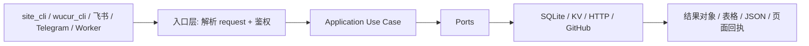

# AnyRouter / Wucur 消息驱动签到与存储统一 - 设计（v4）

> 目标：把已合格需求转成可直接交给实现模型的设计约束，并禁止设计阶段自己发散出新需求。  
> 前提：requirements 已无未关闭阻断项，且设计里的外显行为都能追溯到需求 ID。

## 使用规则

- 必须明确选择一个方案，不能把关键决策留给实现模型。
- 必须给每个设计项标记来源类型：`REQ`、`IMPL`、`TEST`、`OUT`。
- `REQ` 只能来自需求 ID，且必须能追踪到具体需求。
- `IMPL` 只能描述实现细节，不能新增或改变外显行为。
- `TEST` 只能描述验证和回归，不得引入新产品行为。
- `OUT` 只能放发散候选或本次不纳入项，不得进入 tasks。
- 任何新增外显行为，只要需求里找不到对应 ID，就视为发散需求，必须退回需求阶段。

## 1. 设计类型

### 项目类型

- 维护型项目 + 局部新结构

### 为什么属于这一类

- 仓库已有注册、查询、补签到、Worker 触发和 KV 适配代码，不是从零开始。
- 本次重点是把现有脚本、core、Worker 入口收敛成统一业务层与薄入口，而不是重写整个产品。

### 本次设计重点

- 维持现有 `wucur`、`checkin-due`、`worker-dashboard` 兼容入口可用。
- 把注册 / 查询 / 补签到抽成稳定 application use case。
- 把站点差异收敛到 `provider/profile`，避免业务层继续硬编码 `wucur`。
- 把 Worker 触发和后台 UI 维持在 `worker-dashboard`，不把它们塞回 Python 入口。

## 2. 设计总览

**目标：**  
形成一套可复用的签到核心，CLI、SQLite、Cloudflare KV、Worker 页面都走同一套 application 层。

**非目标：**  
不在本轮重写全部现有脚本为单体应用，不做复杂多租户，不把 Worker 改成唯一入口。

**选定方案：**  
采用 `domain / application / ports / infrastructure / adapters` 分层，保留现有脚本作为薄兼容层。

**放弃方案：**  
继续让 `checkin.py`、注册脚本、查询脚本互相 subprocess 调用，不选，因为会继续漂移和重复。

**对应需求：**  
R1, R2, R3, R4, R5, R6, R7, R8, R9

### 2.1 设计来源与边界

| 设计项ID | 来源类型 | 来源需求ID | 是否改变外显行为 | 是否允许进入 tasks | 说明 |
|---|---|---|---|---|---|
| D1 | REQ | R1 | 是 | 是 | 注册 + 自动签到统一用例 |
| D2 | REQ | R2 | 是 | 是 | 查询列表统一用例 |
| D3 | REQ | R3 | 是 | 是 | 补签到统一用例 |
| D4 | REQ | R4 | 是 | 是 | SQLite 本地后端 |
| D5 | REQ | R5 | 是 | 是 | Cloudflare KV 后端与 Worker 触发 |
| D6 | REQ | R6 | 否 | 是 | 消息通道与业务核心解耦 |
| D7 | REQ | R7 | 是 | 是 | 记录字段完整性与回放 |
| D8 | REQ | R8 | 是 | 是 | `site_cli` 多 provider / 多 backend |
| D9 | REQ | R9 | 是 | 是 | 默认补今天未签到账号 |
| D10 | IMPL | R1-R9 | 否 | 是 | 薄入口、port、adapter 的拆分方式 |
| D11 | TEST | R1-R9 | 否 | 是 | 回归与验证范围 |
| D12 | OUT | 无 | 否 | 否 | 第二个网站接入、复杂权限系统、独立前端应用 |

## 3. 现状 / 目标结构与落点

### 维护型项目现状与 patch point

| path | symbol | 当前职责 | 当前限制/问题 | 本次为什么改这里 | 对应需求 |
|---|---|---|---|---|---|
| `checkin.py` | `run_main()` | 主签到入口 | 入口过厚，混合认证、请求、通知和输出 | 需要下沉到 application 与 port | R1, R7 |
| `scripts/register_wucur.py` | `main()` | 注册+签到脚本 | 业务、I/O、payload 兼容混杂 | 需要变成薄兼容层 | R1, R7 |
| `scripts/register_one_account_to_db.py` | `persist_success()` | 结果写 SQLite | 持久化和 payload 归一化耦合 | 需要统一存储适配 | R1, R4, R7 |
| `scripts/query_wucur_accounts_db.py` | `print_table()` | 查询输出 | 仅 CLI 展示 | 需要抽成查询 use case 入口 | R2, R7 |
| `scripts/checkin_due_service.py` | `CheckinDueService` | 补签到编排 | 业务和网络调用仍混在一起 | 这是补签到主编排点 | R3, R4 |
| `scripts/checkin_due_repository.py` | `SqliteCheckinDueRepository` / `CloudflareKvAccountRepository` | 存储适配 | 后端选择和 payload 细节散落 | 需要成为明确的 repository adapter | R4, R5, R7 |
| `core/provider_profile.py` | `ProviderProfileResolver` | 站点 profile 解析 | 与 `utils.config` 存在重复映射 | 需要收敛成唯一 profile 边界 | R6, R7, R8 |
| `worker-dashboard/src/index.js` | `fetch()` | Worker 入口 | 页面、鉴权、触发、路由集中在一处 | 需要保持薄入口但保留触发链路 | R5, R8 |
| `worker-dashboard/src/router.js` | `router()` | 路由到页面和 API | 路由与页面耦合 | 拆分请求路由与入口 | R5, R8 |
| `worker-dashboard/src/pages/accounts.js` | `pageAccounts()` / `apiAccounts()` | 账号列表和详情页面 | 页面与 API 混在一起 | 页面和账号 API 分离 | R8 |
| `worker-dashboard/src/pages/actions.js` | `apiTrigger()` | 鉴权后触发 workflow | 触发和鉴权耦合 | 保持触发端点稳定 | R5, R8 |
| `worker-dashboard/src/pages/callback.js` | `handleCallback()` | 处理触发回调 | 回调和触发入口耦合 | 保留回调语义 | R5, R8 |
| `worker-dashboard/src/lib/store.js` | `listAccounts()` / `getAccount()` / `putAccount()` / `deleteAccount()` | KV CRUD | 业务和 KV 细节耦合 | 统一后台数据访问 | R5, R8 |
| `worker-dashboard/src/lib/github.js` | `triggerWorkflow()` | 调用 GitHub dispatch | 直接暴露 HTTP 细节 | 保持 dispatch 独立 | R5 |
| `worker-dashboard/src/auth.js` | `authMiddleware()` / `handleLogin()` / `handleLogout()` | Worker 鉴权 | 鉴权和页面耦合 | 保持页面与鉴权边界 | R5, R8 |

### 目标结构与职责落点

| 层级 | 名称 | 职责 | 不负责什么 | 依赖方向 | 预计落地位置 | 对应需求 |
|---|---|---|---|---|---|---|
| 模块 | `domain` | 记录、状态、到期判断 | 不做 I/O | 被 application 依赖 | `core/domain.py` | R3, R7 |
| 模块 | `application` | 注册、查询、补签到、触发用例编排 | 不直连具体存储/Worker SDK | 依赖 ports | `core/application/*.py` | R1-R5 |
| 模块 | `ports` | repository / checkin / dispatch 接口定义 | 不做实现 | 被 infrastructure / adapter 实现 | `core/ports/*.py` | R1-R5 |
| 模块 | `provider/profile` | 站点能力、默认值、字段映射 | 不做业务编排 | 被 application / adapter 依赖 | `core/provider_profile.py` | R6, R7, R8 |
| 模块 | `infrastructure` | SQLite / KV / HTTP 实现 | 不放业务规则 | 依赖 ports | `core/infrastructure/*.py` | R4, R5, R7 |
| 组件 | `site_cli` | 本地统一命令入口 | 不写规则 | 调用 application | `cli/site_cli.py`, `pyproject.toml` | R1-R3, R8, R9 |
| 组件 | `message-ingress` | 飞书 / Telegram 消息入口 | 不写业务规则 | 调用 application | `adapters/messages/*.py` | R1-R3, R6 |
| 组件 | `legacy-cli` | 旧 CLI 兼容入口 | 不新增能力 | 调用 application 或保留旧流程 | `wucur_cli/`, `scripts/` | R1-R3, R9 |
| 组件 | `worker-dashboard` | 页面、触发、展示 | 不执行签到 | 调用 GitHub dispatch | `worker-dashboard/` | R5, R8 |

## 4. 方案选择

| 方案 | 描述 | 优点 | 风险/缺点 | 不选原因 | 结论 |
|---|---|---|---|---|---|
| A | 继续用脚本互相调用 | 改动少 | 逻辑继续漂移，测试边界差 | 长期维护差 | 不选 |
| B | 现有脚本保留为薄层，新增统一 request normalizer + command dispatcher，核心下沉到 core | 复用强、可测试、兼容迁移 | 初期改动较多 | — | 选用 |

## 5. 端到端流程

### 流程步骤

1. 入口层接收 `command/provider/backend/...` request，或 Worker 的 `workflow/token`。
2. 入口层先调用 `normalize_command_request()` 补齐 `provider=wucur`、`scope=due` 和部署环境默认 `backend`。
3. 入口层再做鉴权和最小校验，然后调用 `dispatch_command()`。
4. Application 调用 repository / checkin client / dispatch port / clock。
5. Infrastructure 完成 SQLite、KV、HTTP、GitHub API。
6. 结果由入口层转成 CLI 文本、JSON 或 Worker 页面响应。

### 5.1 请求归一规则

| 字段 | 归一方式 | 校验点 | 错误语义 | 处理层 |
|---|---|---|---|---|
| `command` | 必填，不补默认值 | 只允许 `register` / `list` / `checkin` | `INVALID_COMMAND` | `request_normalizer` |
| `provider` | 缺省统一归一为 `wucur` | 仅允许已注册 provider | `UNSUPPORTED_PROVIDER` | `request_normalizer` + `ProviderProfileResolver` |
| `backend` | 本地 CLI / 兼容脚本默认 `sqlite`，Worker / 云端默认 `kv` | 只允许 `sqlite` / `kv` | `INVALID_BACKEND` | `request_normalizer` |
| `scope` | 缺省统一归一为 `due` | 只允许 `due` | `INVALID_SCOPE` | `request_normalizer` |
| `account` | 仅 `register` 需要 | 需包含 `name` / `username` / `password` | `INVALID_ACCOUNT_PAYLOAD` | `request_normalizer` |

归一后的 request 进入 `dispatch_command()`，由 command 决定落到哪个 use case。

## 6. 数据结构与状态模型

### 数据结构

| 名称 | 字段 | 类型 | 必填 | 默认值 | 约束 | 来源/去向 |
|---|---|---|---|---|---|---|
| `StoredAccountRecord` | `record_id` | string | 是 | 无 | 唯一 | repository -> application |
|  | `provider` | string | 是 | 无 | 对应 profile 名称 | repo / entry -> domain |
|  | `name` | string | 是 | 无 | 非空 | entry -> repo |
|  | `username` | string | 是 | 无 | 唯一 | entry -> repo |
|  | `password` | string | 是 | 无 | 本地可明文，云端不可明文 | entry -> repo |
|  | `registered_at` | string \| null | 否 | 无 | `YYYY-MM-DD HH:MM:SS` | repo -> query |
|  | `checkin_date` | string \| null | 否 | 无 | `YYYY-MM-DD` | use case -> repo |
|  | `balance_before` | float \| null | 否 | 无 | 可为空 | checkin client -> repo |
|  | `balance_after` | float \| null | 否 | 无 | 可为空 | checkin client -> repo |
|  | `balance_delta` | float \| null | 否 | 无 | 可为空 | repo -> query |
|  | `used_quota_before` | float \| null | 否 | 无 | 可为空 | checkin client -> repo |
|  | `used_quota_after` | float \| null | 否 | 无 | 可为空 | checkin client -> repo |
|  | `checkin_reward_raw` | int \| null | 否 | 无 | 可为空 | checkin client -> repo |
|  | `last_status` | string \| null | 否 | 无 | `registered` / `logged_in` / `checkin_success` 等 | repo -> query |
|  | `raw_result_json` | string \| null | 否 | 无 | JSON 字符串 | repo -> query |
| `ProviderProfile` | `name` | string | 是 | 无 | 唯一 | resolver -> application |
|  | `domain` | string | 是 | 无 | URL | resolver -> client |
|  | `login_path` | string | 否 | `/login` | 路径 | resolver -> client |
|  | `login_api_path` | string \| null | 否 | `null` | `null` 表示无该能力 | resolver -> client |
|  | `sign_in_path` | string \| null | 否 | `/api/user/sign_in` | `null` 表示自动签到或无接口 | resolver -> client |
|  | `user_info_path` | string \| null | 否 | `/api/user/self` | 可为空 | resolver -> client |
|  | `api_user_key` | string \| null | 否 | `new-api-user` | 可为空 | resolver -> client |
|  | `auth_mode` | enum | 是 | `cookie` | `cookie` / `password_session` / `bearer_login` | resolver -> client |
|  | `bypass_method` | enum \| null | 否 | `null` | `waf_cookies` | resolver -> client |
|  | `waf_cookie_names` | list<string> \| null | 否 | `null` | 需要时非空 | resolver -> client |
| `CheckinSuccessUpdate` | `checkin_date` | string | 是 | 无 | `YYYY-MM-DD` | application -> repo |
|  | `balance_before` / `balance_after` / `balance_delta` | float \| null | 否 | 无 | 可为空 | application -> repo |
|  | `used_quota_before` / `used_quota_after` | float \| null | 否 | 无 | 可为空 | application -> repo |
|  | `checkin_reward_raw` | int \| null | 否 | 无 | 可为空 | application -> repo |
|  | `last_status` | string | 否 | `checkin_success` | 固定成功态 | application -> repo |
|  | `raw_result_json` | string | 否 | `''` | JSON 字符串 | application -> repo |

### 状态变更与副作用

| 触发条件 | 写入对象/外部系统 | 原子性要求 | 幂等性 | 重试策略 | 失败补偿 | 回滚方式 |
|---|---|---|---|---|---|---|
| 注册成功并签到成功 | SQLite / KV | 单条记录尽量原子 | 同账号重复执行应覆盖或去重 | 网络失败可重试 | 不写成功状态 | 失败不提交成功记录 |
| 注册成功但签到失败 | SQLite / KV | 注册与签到结果必须能区分 | 重复注册应覆盖同一用户名 | 可重试签到 | 保留注册记录 | 不回滚注册记录 |
| 补签到保存成功 | SQLite / KV | 单条记录更新原子 | 依赖 `username` 唯一键 | 写回失败可重试 | 不标记成功 | 失败不提交成功记录 |

## 7. 外部契约映射

| 契约样例ID | 来源需求ID | 入口 | 输入结构 | 输出结构 | 错误码/错误消息 | 对应处理符号 |
|---|---|---|---|---|---|---|
| C1 | R1 | `register` CLI / 消息入口 | `command`, `provider`, `backend`, `account{name,username,password}` | `success`, `checkin` | `LOGIN_FAILED`, `CHECKIN_FAILED`, `INVALID_ACCOUNT_PAYLOAD`, `INVALID_BACKEND`, `UNSUPPORTED_PROVIDER` | `RegisterAndCheckinAccountUseCase` |
| C2 | R2 | `list` CLI / 消息入口 | `command`, `provider`, `backend` | `rows` | `UNSUPPORTED_PROVIDER`, `INVALID_BACKEND` | `ListAccountsUseCase` |
| C3 | R3 | `checkin` CLI / 消息入口 | `command`, `provider`, `backend`, `scope` | `succeeded`, `failed`, `skipped` | `CHECKIN_FAILED`, `INVALID_SCOPE`, `UNSUPPORTED_PROVIDER`, `INVALID_BACKEND` | `CheckDueAccountsUseCase` |
| C4 | R4 | SQLite repository | `provider_scope` / `record_id` / `CheckinSuccessUpdate` | SQLite write result | `BACKEND_WRITE_FAILED` | `SqliteCheckinDueRepository` |
| C5 | R5 | Worker 页面按钮 | `workflow`, `token`, `target` | `success`, `workflow`, `defaulted`, `dispatch_id` | `AUTH_FAILED`, `DISPATCH_FAILED` | `SyncRemoteTriggerUseCase`, `GitHubDispatchPort` |

### Worker 触发约定

- `workflow` 为空时默认 `checkin`，成功响应应回传 `defaulted` 标记。
- `token` 可通过查询参数或 `x-worker-token` 请求头传入。
- `GITHUB_TOKEN` 缺失或 GitHub 触发失败时返回 `DISPATCH_FAILED`，不在 Worker 内执行签到。

## 8. 职责边界与实现边界

### 模块 / 组件边界

| 层级 | 名称 | 职责 | 禁止承载的职责 | 与谁交互 | 边界说明 |
|---|---|---|---|---|---|
| module | `application` | 编排用例 | 不写 SQLite/KV/Worker SDK 代码 | ports | 只依赖接口 |
| module | `ports` | 接口定义 | 不写实现 | application / infrastructure | 稳定契约层 |
| module | `provider/profile` | 站点差异归一和默认值解析 | 不直接执行 HTTP/DB | application / infrastructure | `wucur` 只是首个 profile |
| component | `cli` | 本地命令入口 | 不做业务规则 | application | 只解析参数和输出 |
| component | `worker-dashboard` | 页面和触发 | 不执行签到 | GitHub API / KV | 薄入口 |

### 关键文件 / 类 / 方法边界

| 类型 | 名称 | 负责什么 | 不负责什么 | 为什么必须提前定义 |
|---|---|---|---|---|
| 类 | `RegisterAndCheckinAccountUseCase` | 注册、登录、签到编排 | 不负责 CLI 输出 | 这是 C1 核心 |
| 类 | `ListAccountsUseCase` | 账号列表查询 | 不负责表格渲染 | 这是 C2 核心 |
| 类 | `CheckDueAccountsUseCase` / `CheckinDueService` | 到期判断与批量补签到 | 不负责 UI | 这是 C3 核心 |
| 类 | `CloudflareKvAccountRepository` | KV 读写 | 不负责业务规则 | 这是云端后端核心 |
| 类 | `ProviderProfileResolver` | profile 解析和默认值 | 不负责业务编排 | 防止 `wucur` 写死在 use case |
| 类 | `SyncRemoteTriggerUseCase` | Worker 触发 workflow | 不负责页面渲染 | 这是 R5 核心 |

## 9. 文件变更计划 / 目标文件骨架

### 维护型项目文件变更计划

| 文件 | 操作 | 目标符号/类/函数 | 禁止变更的符号 | 变更内容 | 对应需求 |
|---|---|---|---|---|---|
| `core/application/register_and_checkin_account_use_case.py` | 修改 | `RegisterAndCheckinAccountUseCase` | `CheckDueAccountsUseCase` | 收敛注册、登录、签到和回放字段 | R1, R7 |
| `core/application/list_accounts_use_case.py` | 新增 | `ListAccountsUseCase` | 无 | 查询账号列表用例 | R2, R7 |
| `core/application/check_due_accounts_use_case.py` | 新增 | `CheckDueAccountsUseCase` | 无 | 补签到批处理用例 | R3, R7 |
| `core/application/sync_remote_trigger_use_case.py` | 修改 | `SyncRemoteTriggerUseCase` | `RegisterAndCheckinAccountUseCase` | 统一 Worker 触发返回语义 | R5 |
| `core/provider_profile.py` | 修改 | `ProviderProfile`, `ProviderProfileResolver` | `StoredAccountRecord` | 收敛 profile / 默认值 / 异常语义 | R6, R8 |
| `core/ports/*.py` | 修改 / 新增 | `AccountRepository`, `CheckinClient`, `GitHubDispatchPort` | 现有方法签名的无关部分 | 抽接口边界 | R1-R5 |
| `core/application/request_normalizer.py` | 新增 | `normalize_command_request` | 无 | 统一默认 provider/backend/scope，并校验 request 字段 | R1-R3, R8, R9 |
| `core/application/command_dispatcher.py` | 新增 | `dispatch_command` | 无 | 按 command 路由到对应 use case | R1-R3, R5, R8, R9 |
| `cli/site_cli.py` | 新增 | `main()` | 旧 CLI 兼容入口 | 统一本地命令入口 | R1-R3, R8, R9 |
| `adapters/messages/feishu.py` | 新增 | `handle_message()` | 无 | 飞书 webhook 入口 | R1-R3, R6 |
| `adapters/messages/telegram.py` | 新增 | `handle_message()` | 无 | Telegram webhook 入口 | R1-R3, R6 |
| `pyproject.toml` | 修改 | `[project.scripts]` | `wucur`, `checkin-due` | 新增 `site_cli` console script | R8 |
| `scripts/register_wucur.py` | 修改 | `main()` | CLI 参数名 | 变成薄入口 | R1 |
| `scripts/register_one_account.py` | 修改 | `validate_account()` | `REGISTER_SCRIPT_PATH` | 对齐 request 校验 | R1 |
| `scripts/register_one_account_to_db.py` | 修改 | `persist_success()` | 旧表字段 | 兼容统一 payload | R1, R7 |
| `scripts/query_wucur_accounts_db.py` | 修改 | `main()` / `print_table()` | 输出字段 | 保持输出稳定，内部薄化 | R2 |
| `scripts/checkin_due_service.py` | 修改 | `CheckinDueService` | `CheckinAccountResult` | 接口对齐 application 用例 | R3 |
| `scripts/checkin_due_repository.py` | 修改 | `SqliteCheckinDueRepository`, `CloudflareKvAccountRepository` | `build_backend_repository` 参数 | 存储后端统一适配 | R4, R5 |
| `worker-dashboard/src/index.js` | 修改 | `fetch()` | 路由语义 | 维持薄 Worker 入口 | R5, R8 |

### 目标文件骨架

| 文件/目录 | 类型 | 职责 | 为什么存在 | 对应模块/组件 | 对应需求 |
|---|---|---|---|---|---|
| `core/domain.py` | 文件 | 领域对象和状态 | 统一数据模型 | domain | R3, R7 |
| `core/application/` | 目录 | 用例编排 | 复用业务流程 | application | R1-R5 |
| `core/application/request_normalizer.py` | 文件 | 统一 request 默认值与字段校验 | 不负责业务编排 | 入口层 / dispatch 依赖 | R1-R3, R8, R9 |
| `core/application/command_dispatcher.py` | 文件 | 按 command 路由到具体 use case | 不负责业务规则本身 | 入口层调用 | R1-R3, R5, R8, R9 |
| `core/ports/` | 目录 | 接口定义 | 解耦实现 | ports | R1-R5 |
| `core/provider_profile.py` | 文件 | 站点 profile 边界 | 收敛默认值与能力 | provider/profile | R6, R8 |
| `core/infrastructure/` | 目录 | 适配层 | SQLite/KV/HTTP | infrastructure | R4, R5 |
| `cli/site_cli.py` | 文件 | 本地统一 CLI 入口 | 不负责业务规则 | adapter | R1-R3, R8, R9 |
| `adapters/messages/` | 目录 | 飞书 / Telegram 入口 | 不负责业务规则 | adapter | R1-R3, R6 |
| `worker-dashboard/src/index.js` | 文件 | Worker 入口 | 不负责业务规则 | adapter | R5, R8 |
| `worker-dashboard/src/router.js` | 文件 | 路由分发 | 不负责业务规则 | adapter | R5, R8 |
| `worker-dashboard/src/pages/accounts.js` | 文件 | 账号列表/详情/触发 UI | 不负责触发实现 | adapter | R8 |
| `worker-dashboard/src/pages/actions.js` | 文件 | 触发 API | 不负责页面渲染 | adapter | R5, R8 |
| `worker-dashboard/src/pages/callback.js` | 文件 | 回调处理 | 不负责页面渲染 | adapter | R5, R8 |
| `worker-dashboard/src/lib/store.js` | 文件 | KV CRUD | 不负责页面和鉴权 | adapter | R5, R8 |
| `worker-dashboard/src/lib/github.js` | 文件 | GitHub dispatch | 不负责页面和鉴权 | adapter | R5 |
| `worker-dashboard/src/auth.js` | 文件 | 鉴权 | 不负责页面渲染 | adapter | R5, R8 |

## 10. 错误处理

| 场景 | 检测点 | 系统处理 | 用户可见结果 | 是否可重试 | 日志要求 | 指标/告警 |
|---|---|---|---|---|---|---|
| 输入非法 | CLI / Worker 参数解析 | 返回校验失败，不进入用例 | `INVALID_ACCOUNT_PAYLOAD` / `INVALID_SCOPE` / `INVALID_BACKEND` / `INVALID_PROVIDER` | 否 | 只记输入摘要 | 计数 |
| command 不存在 | `request_normalizer` / command dispatcher | 返回 `INVALID_COMMAND`，不进入用例 | `INVALID_COMMAND` | 否 | 记录 command 名称 | 计数 |
| provider 不存在 | `ProviderProfileResolver` | 返回 `UNSUPPORTED_PROVIDER`，不进入登录或签到流程 | `UNSUPPORTED_PROVIDER` | 否 | 记录 provider 名称 | 计数 |
| backend 不存在 | 入口层 / repository factory | 返回 `INVALID_BACKEND` | `INVALID_BACKEND` | 否 | 记录 backend 名称 | 计数 |
| 登录失败 | checkin client | 返回失败结果，不写成功状态 | `LOGIN_FAILED` | 是 | 只记摘要 | 计数 |
| KV 写失败 | repository | 失败返回，不标记成功 | `BACKEND_WRITE_FAILED` | 是 | 记录 backend 名称 | 告警 |
| Worker 鉴权失败 | worker handler | 返回 `AUTH_FAILED` | 页面展示失败 | 否 | 记录 token 校验失败摘要 | 计数 |
| Worker 触发失败 | trigger port | 返回 `DISPATCH_FAILED` | 页面展示失败 | 是 | 记录 workflow 名称 | 计数 |
| 不可恢复内部错误 | application / use case | 返回通用错误码并中断当前账号 | `INTERNAL_ERROR` | 否 | 记录堆栈摘要和上下文 | 告警 |

## 11. 兼容性、迁移与回滚

### 兼容性

- 旧的 `wucur` CLI 保持可用。
- 现有 `checkin-due` 命令保持可用。
- 现有 SQLite 查询命令保持可用。
- `utils.config` 仍可提供兼容入口，逐步转向 `core/provider_profile.py`。

### 迁移步骤

1. 先把 domain / ports / provider profile 抽出来。
2. 再把现有脚本接到新 use case。
3. 最后把 Worker 触发和后台 UI 对齐到统一 contract。

### 回滚方式

1. 若重构失败，保留旧 CLI 作为回退入口。
2. 新增的云端适配可独立关闭。

## 12. 依赖与配置变更

### 依赖策略

| 依赖 | 动作 | 版本范围 | 原因 | 替代方案 | 风险 |
|---|---|---|---|---|---|
| `httpx` | 不变 | 当前版本 | 现有网络调用 | 无 | 低 |
| `playwright` | 不变 | 当前版本 | 现有 WAF / 浏览器流程 | 无 | 低 |
| `python-dotenv` | 不变 | 当前版本 | 环境变量加载 | 无 | 低 |

### 配置项

| 配置名 | 位置 | 默认值 | 是否必填 | 错误配置时的行为 | 对应需求 |
|---|---|---|---|---|---|
| `ANYROUTER_ACCOUNTS` | env | 无 | 是 | CLI / Actions 读取失败 | R1-R3 |
| `PROVIDERS` | env | 无 | 否 | 覆盖 provider profile | R6, R8 |
| `GITHUB_TOKEN` | env/secret | 无 | 云端必填 | Worker 触发失败 | R5 |
| `GITHUB_REPO` | env/secret | 无 | 云端必填 | Worker 触发失败 | R5 |
| `WORKER_SECRET` / `CALLBACK_SECRET` | env/secret | 无 | 云端必填 | 鉴权失败 | R5 |
| `CLOUDFLARE_KV` | env/secret | 无 | 云端必填 | 云端存储失败 | R4 |
| `PASSWORD_ENCRYPTION_KEY` | env/secret | 无 | 云端必填 | 云端密码加密失败 | R4, R6 |

## 13. 安全与数据处理

| 类别 | 约束 | 实现要求 | 验证方式 |
|---|---|---|---|
| 敏感数据 | 密码不可明文写云端或普通日志 | 本地 SQLite 可保留明文，云端写入前必须加密 | 搜索日志输出 / repository 测试 |
| 鉴权 | Worker 页面和回调都要鉴权 | Secret / token 校验 | 请求拒绝测试 |
| 输入校验 | 命令参数和 JSON 配置 | 入口层校验字段、默认值、枚举 | 单测 |
| 数据回放 | 本地查询要能回放完整字段 | 记录 `raw_result_json` 和关键字段 | 查询测试 |

## 14. 测试与验证策略

| 测试类型 | 覆盖点 | 工作目录 | 命令 | 通过标准 | 回归保护对象 |
|---|---|---|---|---|---|
| 单元测试 | domain / provider profile / use case | `anyrouter-check-in` | `uv run pytest` | 全绿 | 现有 CLI 行为 |
| 集成测试 | SQLite / 查询 / 补签到 / KV | `anyrouter-check-in` | `uv run pytest tests/...` | 全绿 | 数据写入和回放 |
| 端到端测试 | CLI / Worker / dispatch | `anyrouter-check-in` | `node --test tests/*.node.mjs` | 全绿 | Worker 入口与后台 UI |
| 结构检查 | 文档/接口边界 | `anyrouter-check-in` | 手动评审 | 设计一致 | 模块职责 |

## 15. 需求追踪

| 需求ID | 设计项ID | 文件/符号 | 类型 | 验证 |
|---|---|---|---|---|
| R1 | D1 | `cli/site_cli.py::main`, `adapters/messages/feishu.py::handle_message`, `adapters/messages/telegram.py::handle_message`, `core/application/command_dispatcher.py::dispatch_command` | REQ | 注册测试 |
| R2 | D2 | `cli/site_cli.py::main`, `adapters/messages/feishu.py::handle_message`, `adapters/messages/telegram.py::handle_message`, `core/application/command_dispatcher.py::dispatch_command` | REQ | 查询测试 |
| R3 | D3 | `cli/site_cli.py::main`, `adapters/messages/feishu.py::handle_message`, `adapters/messages/telegram.py::handle_message`, `core/application/command_dispatcher.py::dispatch_command` | REQ | 补签到测试 |
| R4 | D4 | `scripts/checkin_due_repository.py::SqliteCheckinDueRepository` | REQ | SQLite 测试 |
| R5 | D5 | `core/application/sync_remote_trigger_use_case.py::SyncRemoteTriggerUseCase` | REQ | Worker 触发测试 |
| R6 | D6, D7, D8 | `core/provider_profile.py`, `core/application/request_normalizer.py`, `adapters/messages/*` | REQ | provider/profile 与 request 结构测试 |
| R7 | D7 | `core/domain.py::StoredAccountRecord` / `CheckinSuccessUpdate` | REQ | 记录字段测试 |
| R8 | D8 | `cli/site_cli.py`, `pyproject.toml`, `worker-dashboard/` | REQ | `site_cli` / Worker 测试 |
| R9 | D3 | `core/application/check_due_accounts_use_case.py::CheckDueAccountsUseCase` | REQ | 默认补签测试 |

## 16. 实现前最终检查

- [ ] requirements 中无未关闭阻断项
- [ ] 已明确当前是维护型项目还是新项目
- [ ] 已明确选定方案，未把关键决策留给实现模型
- [ ] 所有新增外显行为都能追到需求 ID
- [ ] 没有把发散需求伪装成 IMPL / TEST
- [ ] `OUT` 项没有进入 tasks
- [ ] 维护型项目已明确 patch point 到文件和符号级
- [ ] 已明确哪些关键方法或等价处理单元必须提前定义职责边界
- [ ] 已明确副作用、幂等性、重试、补偿、回滚
- [ ] 已明确旧行为兼容性和回归验证
- [ ] 已明确是否允许新增依赖
- [ ] 已明确 `provider/profile` 只是抽象边界，不是本轮接入第二个网站
- [ ] 已明确 Worker 管理后台 UI 的数据来源和展示边界
