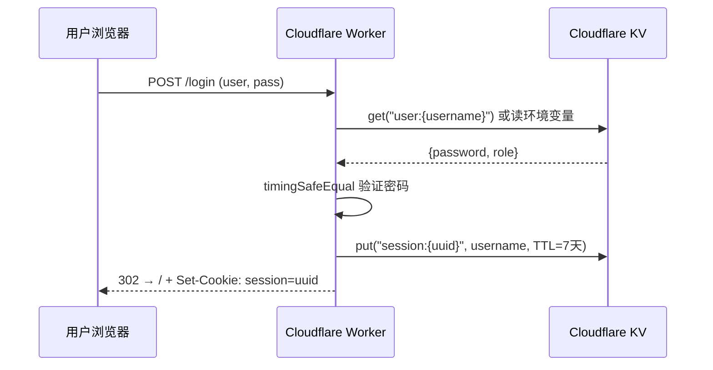
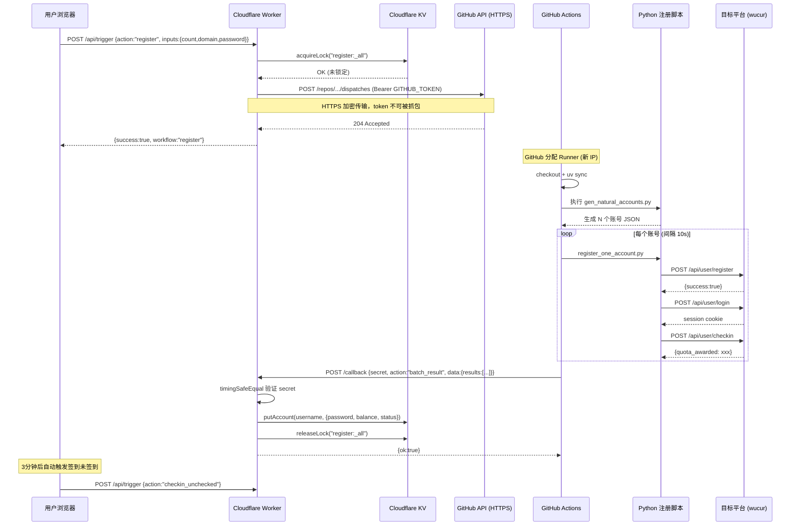
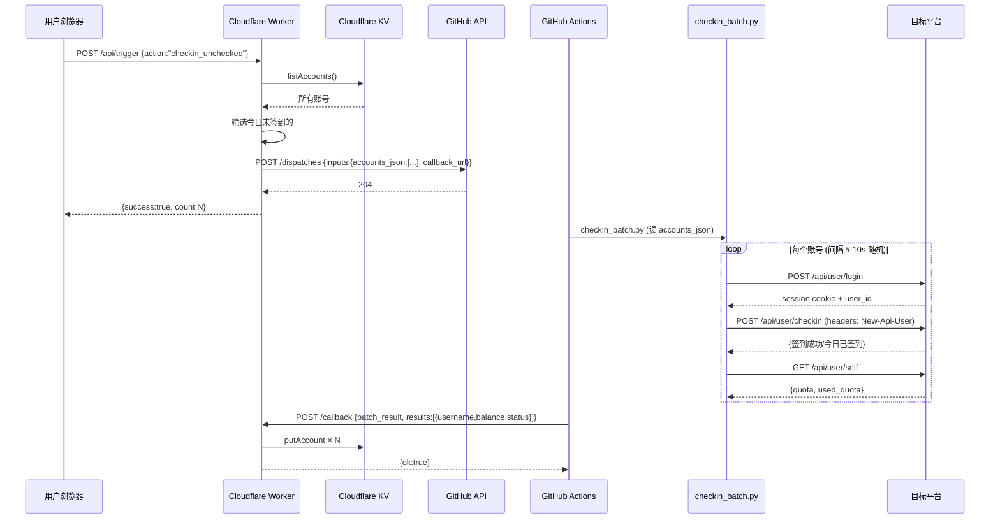
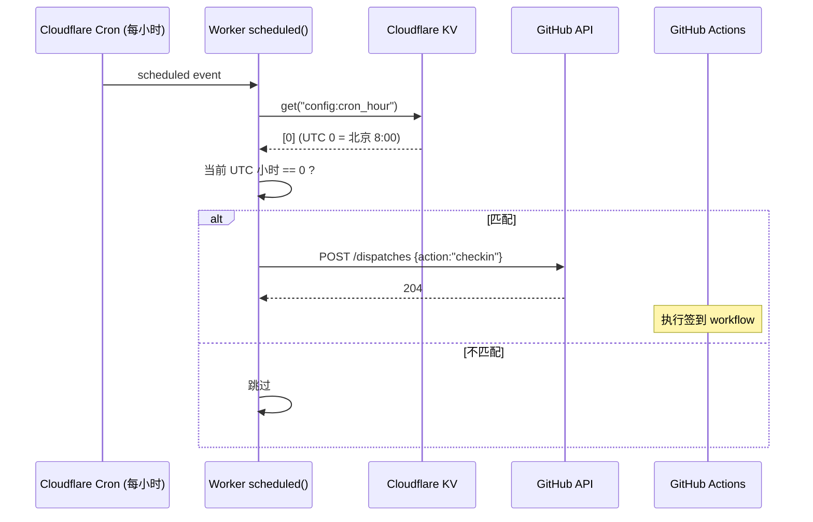
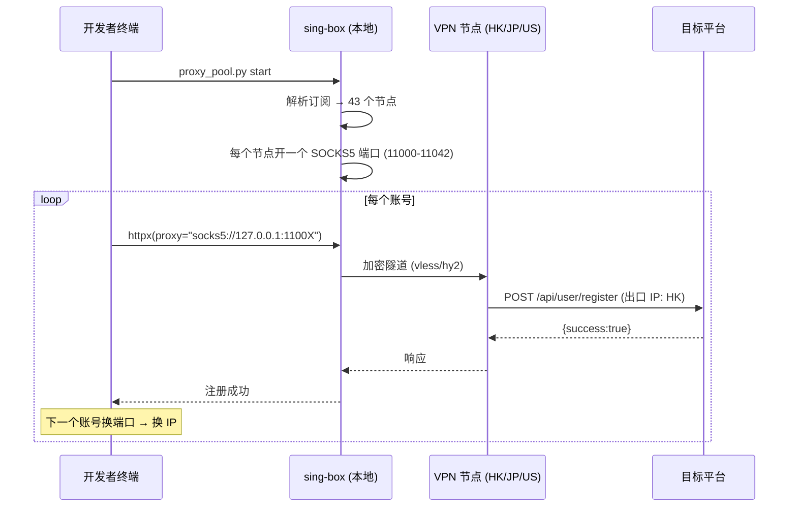
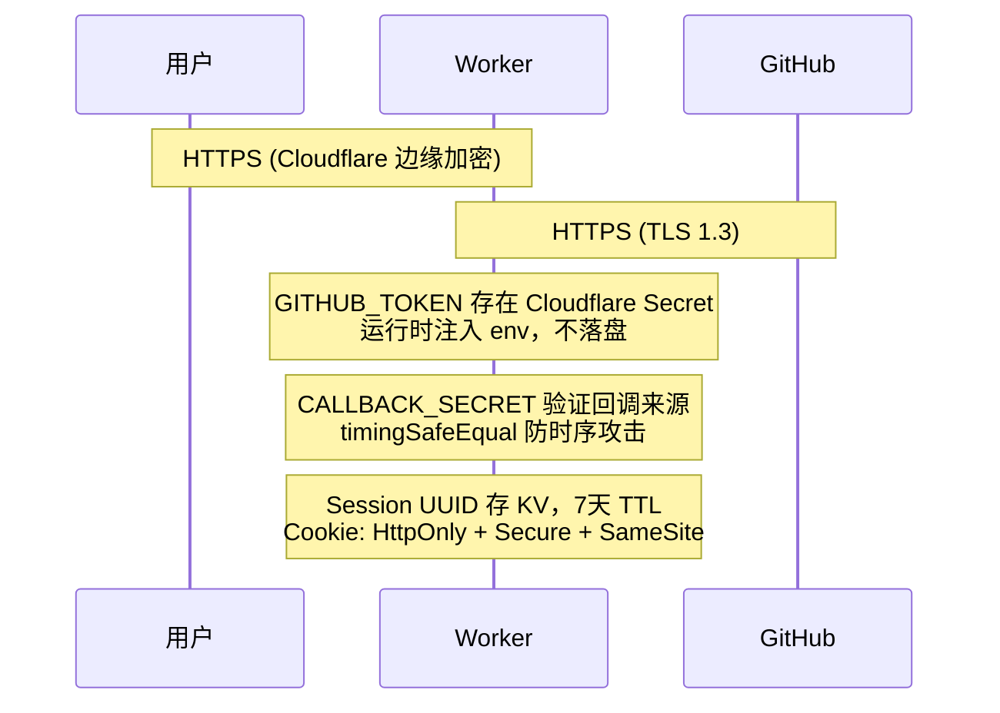

# 系统调用链时序图

## 1. 用户登录

```mermaid
sequenceDiagram
    participant U as 用户浏览器
    participant W as Cloudflare Worker
    participant KV as Cloudflare KV

    U->>W: POST /login (user, pass)
    W->>KV: get("user:{username}") 或读环境变量
    KV-->>W: {password, role}
    W->>W: timingSafeEqual 验证密码
    W->>KV: put("session:{uuid}", username, TTL=7天)
    W-->>U: 302 → / + Set-Cookie: session=uuid
```

## 2. 批量注册

```mermaid
sequenceDiagram
    participant U as 用户浏览器
    participant W as Cloudflare Worker
    participant KV as Cloudflare KV
    participant GH as GitHub API (HTTPS)
    participant GA as GitHub Actions
    participant PY as Python 注册脚本
    participant TG as 目标平台 (wucur)

    U->>W: POST /api/trigger {action:"register", inputs:{count,domain,password}}
    W->>KV: acquireLock("register:_all")
    KV-->>W: OK (未锁定)
    W->>GH: POST /repos/.../dispatches (Bearer GITHUB_TOKEN)
    Note over W,GH: HTTPS 加密传输，token 不可被抓包
    GH-->>W: 204 Accepted
    W-->>U: {success:true, workflow:"register"}

    Note over GA: GitHub 分配 Runner (新 IP)
    GA->>GA: checkout + uv sync
    GA->>PY: 执行 gen_natural_accounts.py
    PY-->>GA: 生成 N 个账号 JSON

    loop 每个账号 (间隔 10s)
        GA->>PY: register_one_account.py
        PY->>TG: POST /api/user/register
        TG-->>PY: {success:true}
        PY->>TG: POST /api/user/login
        TG-->>PY: session cookie
        PY->>TG: POST /api/user/checkin
        TG-->>PY: {quota_awarded: xxx}
    end

    GA->>W: POST /callback {secret, action:"batch_result", data:{results:[...]}}
    W->>W: timingSafeEqual 验证 secret
    W->>KV: putAccount(username, {password, balance, status})
    W->>KV: releaseLock("register:_all")
    W-->>GA: {ok:true}

    Note over U: 3分钟后自动触发签到未签到
    U->>W: POST /api/trigger {action:"checkin_unchecked"}
```

## 3. 一键签到未签到

```mermaid
sequenceDiagram
    participant U as 用户浏览器
    participant W as Cloudflare Worker
    participant KV as Cloudflare KV
    participant GH as GitHub API
    participant GA as GitHub Actions
    participant PY as checkin_batch.py
    participant TG as 目标平台

    U->>W: POST /api/trigger {action:"checkin_unchecked"}
    W->>KV: listAccounts()
    KV-->>W: 所有账号
    W->>W: 筛选今日未签到的
    W->>GH: POST /dispatches {inputs:{accounts_json:[...], callback_url}}
    GH-->>W: 204
    W-->>U: {success:true, count:N}

    GA->>PY: checkin_batch.py (读 accounts_json)

    loop 每个账号 (间隔 5-10s 随机)
        PY->>TG: POST /api/user/login
        TG-->>PY: session cookie + user_id
        PY->>TG: POST /api/user/checkin (headers: New-Api-User)
        TG-->>PY: {签到成功/今日已签到}
        PY->>TG: GET /api/user/self
        TG-->>PY: {quota, used_quota}
    end

    GA->>W: POST /callback {batch_result, results:[{username,balance,status}]}
    W->>KV: putAccount × N
    W-->>GA: {ok:true}
```

## 4. 定时自动签到 (Cron)

```mermaid
sequenceDiagram
    participant CF as Cloudflare Cron (每小时)
    participant W as Worker scheduled()
    participant KV as Cloudflare KV
    participant GH as GitHub API
    participant GA as GitHub Actions

    CF->>W: scheduled event
    W->>KV: get("config:cron_hour")
    KV-->>W: [0] (UTC 0 = 北京 8:00)
    W->>W: 当前 UTC 小时 == 0 ?
    alt 匹配
        W->>GH: POST /dispatches {action:"checkin"}
        GH-->>W: 204
        Note over GA: 执行签到 workflow
    else 不匹配
        W->>W: 跳过
    end
```

## 5. 本地代理池注册

```mermaid
sequenceDiagram
    participant DEV as 开发者终端
    participant SB as sing-box (本地)
    participant VPN as VPN 节点 (HK/JP/US)
    participant TG as 目标平台

    DEV->>SB: proxy_pool.py start
    SB->>SB: 解析订阅 → 43 个节点
    SB->>SB: 每个节点开一个 SOCKS5 端口 (11000-11042)

    loop 每个账号
        DEV->>SB: httpx(proxy="socks5://127.0.0.1:1100X")
        SB->>VPN: 加密隧道 (vless/hy2)
        VPN->>TG: POST /api/user/register (出口 IP: HK)
        TG-->>VPN: {success:true}
        VPN-->>SB: 响应
        SB-->>DEV: 注册成功
        Note over DEV: 下一个账号换端口 → 换 IP
    end
```

## 6. 安全边界

```mermaid
sequenceDiagram
    participant U as 用户
    participant W as Worker
    participant GH as GitHub

    Note over U,W: HTTPS (Cloudflare 边缘加密)
    Note over W,GH: HTTPS (TLS 1.3)
    Note over W: GITHUB_TOKEN 存在 Cloudflare Secret<br/>运行时注入 env，不落盘
    Note over W: CALLBACK_SECRET 验证回调来源<br/>timingSafeEqual 防时序攻击
    Note over W: Session UUID 存 KV，7天 TTL<br/>Cookie: HttpOnly + Secure + SameSite
```
