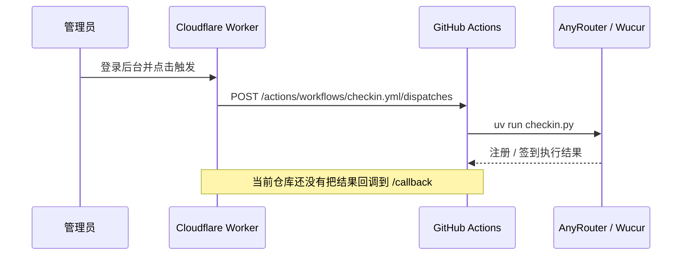

# Worker + GitHub Actions 协作部署指南

本文档说明如何把本仓库部署成“Cloudflare Worker 负责后台、鉴权、触发与回调，GitHub Actions 负责真正执行注册 / 签到”的协作模式。

## 先说结论

当前代码只能**部分**满足协作部署。

- 已经具备的能力
  - Worker 可以通过 GitHub API 触发 workflow dispatch。
  - Worker 已经有 `/callback` 回调入口，可以把 GitHub Actions 的结果写回 KV。
  - GitHub Actions 的 `checkin.yml` 可以独立执行固定的签到脚本。

- 还没有打通的能力
  - `checkin.yml` 目前没有定义 `workflow_dispatch.inputs`，也没有消费 `action` / `target` / `callback_url`。
  - workflow 里也没有把结果 POST 回 Worker 的 `/callback`。

结论是：**当前仓库可以部署并跑固定签到，但“Worker 发起 - GitHub 执行 - Worker 回写”的完整协作闭环还没完成。**

## 现有链路



## 当前文件职责

- [`worker-dashboard/src/lib/github.js`](../worker-dashboard/src/lib/github.js): 发送 workflow dispatch 请求。
- [`worker-dashboard/src/pages/actions.js`](../worker-dashboard/src/pages/actions.js): 触发 GitHub workflow 的 API。
- [`worker-dashboard/src/pages/callback.js`](../worker-dashboard/src/pages/callback.js): 接收 GitHub Actions 完成后的回调并写 KV。
- [`.github/workflows/checkin.yml`](../.github/workflows/checkin.yml): GitHub Actions 的实际签到执行入口。
- [`worker-dashboard/wrangler.toml`](../worker-dashboard/wrangler.toml): Worker 的 vars / secrets / KV 配置入口。

## 部署前提

### GitHub 侧

1. 仓库已启用 GitHub Actions。
2. 目标 workflow 文件存在，默认是 `.github/workflows/checkin.yml`。
3. `production` environment 已创建，并挂好 secrets。

### Worker 侧

1. Cloudflare Worker 已创建。
2. `KV` namespace 已绑定。
3. Worker 能访问 GitHub API。

## GitHub Actions 要配什么

### 必填

- `ANYROUTER_ACCOUNTS`
  - 账号配置 JSON。
  - 这是签到脚本真正读取的核心数据。

### 视情况填写

- `PROVIDERS`
  - 只有你要覆盖默认 provider 行为时才需要。
- `DINGDING_WEBHOOK`
- `EMAIL_USER`
- `EMAIL_PASS`
- `EMAIL_TO`
- `EMAIL_SENDER`
- `CUSTOM_SMTP_SERVER`
- `PUSHPLUS_TOKEN`
- `SERVERPUSHKEY`
- `FEISHU_WEBHOOK`
- `WEIXIN_WEBHOOK`
- `TELEGRAM_BOT_TOKEN`
- `TELEGRAM_CHAT_ID`
- `GOTIFY_URL`
- `GOTIFY_TOKEN`
- `GOTIFY_PRIORITY`
- `BARK_KEY`
- `BARK_SERVER`

### 重要说明

- `GITHUB_TOKEN` **不是** GitHub Actions job 本身要配的环境变量。
- `GITHUB_TOKEN` 是 Worker 用来调用 GitHub dispatch API 的 secret。
- 如果你要做“GitHub Actions 完成后回调 Worker”的闭环，GitHub Actions 这边还需要一份 `CALLBACK_SECRET`，用来 POST `/callback` 时做身份验证。

## Worker 要配什么

在 `worker-dashboard/wrangler.toml` 和 Cloudflare secret / vars 里配置：

- `GITHUB_REPO`
  - 格式通常是 `owner/repo`。
- `GITHUB_TOKEN`
  - 需要有 GitHub Actions 触发权限。
  - 对 fine-grained token，GitHub 官方文档要求 `Actions: write`。
  - classic PAT 则需要 `repo` scope。
- `GITHUB_WORKFLOW`
  - 默认 `checkin.yml`。
- `CALLBACK_SECRET`
  - Worker `/callback` 的验签密钥。
- `ADMIN_USER`
- `ADMIN_PASS`
- `SESSION_SECRET`
- `KV` binding

## 两种部署模式

### 模式 A：当前可用的固定签到模式

适合先上线验证基础运行：

1. Worker 只负责后台与触发。
2. GitHub Actions 只跑固定的 `uv run checkin.py`。
3. `action` / `target` / `callback_url` 可以先不接。

这个模式能跑，但 Worker 触发只是“启动一次固定签到任务”，还不算完整协作。

### 模式 B：完整协作模式

适合你要的“部署后就能协作工作”：

1. Worker 触发 GitHub workflow dispatch。
2. workflow 读取 `action` / `target` / `callback_url`。
3. workflow 执行完成后把结果 POST 到 Worker `/callback`。
4. Worker 把结果写回 KV。

这个模式需要补 workflow，当前仓库还没完全实现。

## 建议部署顺序

### 1. 先把 GitHub Actions 跑通

1. 在仓库的 `Settings -> Environments` 创建 `production`。
2. 把 `ANYROUTER_ACCOUNTS` 等 secrets 填好。
3. 在 `Actions` 页面手动运行一次 `AnyRouter 自动签到`。
4. 确认日志里能看到 `uv run checkin.py` 正常执行。

### 2. 再部署 Worker

1. 在 Cloudflare 上创建 Worker。
2. 配好 `GITHUB_REPO`、`GITHUB_TOKEN`、`GITHUB_WORKFLOW`、`CALLBACK_SECRET`。
3. 绑定 KV namespace。
4. 部署后登录后台，确认页面能正常渲染。

### 3. 再测 Worker 触发

1. 在 Worker 后台点击触发按钮。
2. 确认 Worker 的 `/api/trigger` 返回成功。
3. 到 GitHub Actions 页面确认 workflow 被启动。

### 4. 如果要真正协作，再补 workflow

你需要把 `.github/workflows/checkin.yml` 扩展成下面这种思路：

```yaml
on:
  workflow_dispatch:
    inputs:
      action:
        required: false
        default: checkin
      target:
        required: false
        default: ""
      callback_url:
        required: false
        default: ""
```

然后在 job 结束后，根据 `callback_url` POST 回 Worker `/callback`。

## 需要验证的关键点

- GitHub dispatch API 能否成功返回 200。
- workflow 是否真的被手动 / API 触发。
- `checkin.yml` 是否真的读取了 dispatch inputs。
- 回调请求是否带了正确的 `secret`。
- Worker 是否把 callback 数据写回 KV。

## 现在的真实状态

如果只问“能不能部署后协作工作”，答案是：**还不能完整做到**。

如果只问“能不能部署并跑固定签到”，答案是：**可以**。

## 参考路径

- [`docs/wucur-github-checkin-guide.md`](./wucur-github-checkin-guide.md)
- [`worker-dashboard/README.md`](../worker-dashboard/README.md)
- [`.github/workflows/checkin.yml`](../.github/workflows/checkin.yml)
